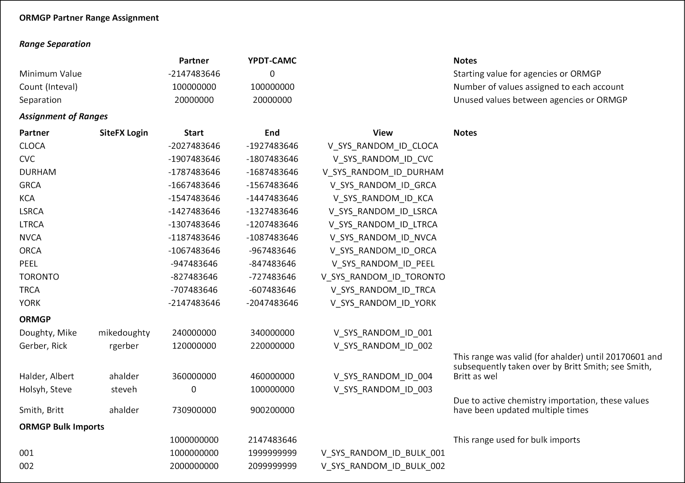

## Section 2.1.3 Other Tables

Other table prefixes are used within the database, mainly S_\*.  These tables
are used for a variety of purposes but are not generally accessed directly by
a user (outside of specific software).  Those tables not described in Section
2.1.1 or 2.1.2 (or this section) are unused in this version of the database
(and are empty) or are SiteFX specific.  Many of these will be related to
SiteFX's sample or history tracking/management capability.

#### S_USER

This table is exclusively used by SiteFX for user tracking.

Though also mentioned in Section 2.1.3 (Other; below), this table also
contains the 'range' of numeric identifiers available to each partner agency
(refer also to V_SYS_S_USER_ID_RANGES).  This allows data to be input at each
partner agency without the possibility of primary key conflicts when
synchronizing between partner agencies.  Note that the changeover from a
database replication sharing to a remote (and web) database access has reduced
the importance of this feature.

Users/partners using SiteFX will automatically be limited to their own range
(note that these are keyed by the user-login which should be specific to the
partner agency; all logins for a particular agency will be given the same
range of values).  The users of alternative software must take care that any
keys used created for the import of data correspond to their particular
partner agency range (refer to the views V_SYS_RANDOM_ID_\* for this purpose).  

The ranges of values are shown in the following table.

*Table 2.1.3.1 Range of identifiers assigned to partner agencies and users.*

#### W_GENERAL

Each of the W_\* data tables contain summaries of information used
specifically for 'web' access, especially with regard to online mapping
(almost all contain a GEOM field for coordinates as well as each of a CA_ID,
REG_ID and SWP_ID relating to the contained area in which the location lies).
Each of the tables includes a GIS_ID field with values greater than zero -
such a key is required by the mapping backend software (Geocortex - Latitude
Geographics, 2017; and ArcGIS - ESRI, 2017).

This table contains 'general' location information, mainly focused on
boreholes.  Temporal data availability and ranges is also listed.  This is
related to D_LOCATION using LOC_ID.

Note that all 'W_*' tables are automatically re-populated weekly and rely upon
information present in the D_LOCATION_SUMMARY and D_INTERVAL_SUMMARY tables
(though not exclusively).

##### Field - GEOL_FEAT

This field is used to assemble the 'Water Found' information as commonly
defined on the MOE water-well master sheets.  As more than one water type can
be specified, these have been converted to a text-string of 0/1 values such
as '001001'.  For additional details, refer to the description of
V_SYS_W_GENERAL_GEOL_FEAT (which assembles the data for this field).

#### W_GENERAL_DOCUMENT

This table contains information from the D_LOCATION and D_DOCUMENT tables and
includes a formatted bibliographic reference field (BIBLIO).  This is related
to D_LOCATION using LOC_ID.  Refer to W_GENERAL, above, for information
concerning the 'W_' tables.

#### W_GENERAL_GROUP

This table contains information regarding the various groupings (and types) of
wells (as found in D_GROUP_LOCATION and related tables).

#### W_GENERAL_GW_LEVEL

This table contains daily averages of water levels as well as (if available)
manual water levels for any interval with more than 25 records.  This table is
used in conjunction with W_GENERAL_SCREEN for plotting purposes.   This is
related to D_LOCATION using LOC_ID and D_INTERVAL using INT_ID.  Refer to
W_GENERAL, above, for information concerning the 'W_' tables.

#### W_GENERAL_OTHER

This table contains summary information for non-borehole locations as
specified in the field TYPE (e.g. Climate Stations and Surface Water
Stations).  It is related to D_LOCATION using LOC_ID and D_INTERVAL using
INT_ID.  Refer to W_GENERAL, above, for information concerning the 'W_'
tables.

#### W_GENERAL_PICK

This table contains the picks (as found in D_PICK) as well as associated
information.

#### W_GENERAL_SCREEN

This table contains summary information for screened intervals (i.e. screened
well intervals) as described in R_INT_TYPE_CODE (above).  It is related to
D_LOCATION using LOC_ID and D_INTERVAL using INT_ID.  This table is used as a
locational reference for information in W_GENERAL_GW_LEVEL.  Refer to
W_GENERAL, above, for information concerning the 'W_' tables.

*Last Modified: 2023-05-03*
