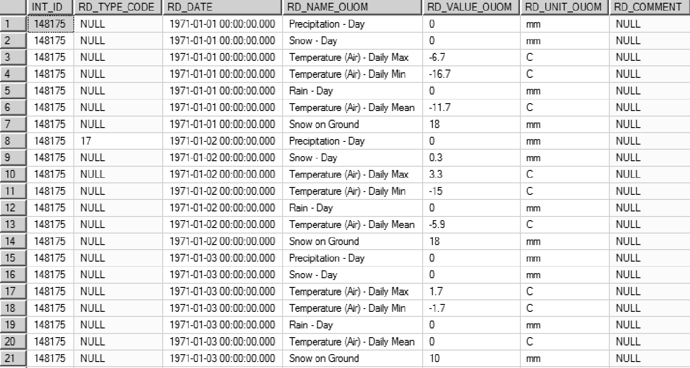

## Section 2.3.6 Climate Station Data

Climate station data, considered ‘field’ data, are stored in a single table - D_INTERVAL_TEMPORAL_2 (along with all other ‘field’ -type information).  Climate stations, besides having an assigned location identifier (as found in D_LOCATION; they are also referenced in D_CLIMATE - refer to Section 2.1 for details), are considered to consist of a single ‘interval’ against which temporal data can be tagged (or linked).  As such, each climate station also has an interval identifier (INT_ID; as found in D_INTERVAL).  This INT_ID allows the user to insert or access information from the D_INTERVAL_TEMPORAL_2 table.

The example given is for the ‘Toronto Lester B. Pearson International Airport’ climate station, daily averages, and is the standard format for climate information from Environment Canada.  A single month is shown (January 1-31) for 1971; the data is split across two windows.

*Figure 2.3.6.1 Example Climate Station - source data*

Note that the format is ‘column-centric’ as is standard for spreadsheet
distributed information.  This information needs to be transformed to a
‘row-centric’ format required for database data entry.  Each row of input
information will consist of a single parameter (e.g. ‘Mean Temp’) tagged with
the interval identifier for the ‘Toronto Lester B. Pearson ...’ location and
include the date and the  parameter units.  Thus for each day of the dataset,
there will one row for each parameter.  Details are provided as follows:

* INT_ID; specific to ‘Toronto Lester B. Pearson ...’ climate station (148175); this will be the same for ALL rows for this data set
* RD_DATE; the date-time at which the measurement was taken; in this case, the date is given in dd/mm/yyyy format as well as divided into separate Year, Month and Day columns; this field must be carefully populated due to the number of possible date-time formats that are in use (Microsoft SQL standard is ‘yyyy-mm-dd hh:mm’); this will be the same for ALL PARAMETERS recorded on the particular date
* RD_NAME_OUOM; this will conform to the parameter name as provided (or possibly modified, see following) from the original source file; note that this parameter name must exist within the database (refer to R_RD_NAME_CODE and R_READING_NAME_ALIAS) - if it does not, the parameter name must be changed to the database-equivalent form (or the name added as an alias; refer also to Section 2.1 for table information)
* RD_VALUE_OUOM; contains the value for the particular parameter (a numeric value)
* RD_UNIT_OUOM; contains the units for the particular parameter; these specified units must exist in the R_UNIT_CODE and R_UNIT_CONV tables (or added as necessary)
* RD_TYPE_CODE; if there additional details regarding the specific parameter (for the particular reading), further information can be included using this type code; refer to R_RD_TYPE_CODE for details; an example here for the date ‘1971-01-02’ is the use of an RD_TYPE_CODE value of ‘17’ (which maps to ‘Climate - Trace Amount’) though a value of ‘0’ is given in the RD_VALUE_OUOM field
* RD_COMMENT; an optional field - additional information about the particular parameter (and date) can be included in the free-form text field (unused in this example)

The example input format is shown below

*Figure 2.3.6.2 Example Climate Station - data input format*

Upon import of the information, into the database, a conversion routine is run against the ‘new’ information (currently through SiteFX) which populates the other fields, as appropriate, in the D_INTERVAL_TEMPORAL_2 table

*Figure 2.3.6.3 Example Climate Station - imported data*

Note that the primary data fields (i.e. RD_NAME_CODE, RD_VALUE and UNIT_CODE) have now been populated with their converted values from the original _OUOM fields (as found in the R_UNIT_CODE and R_UNIT_CONV tables).  In this case, though, no conversion of the RD_VALUE_OUOM field was required as they original units of measure were already system units - as such, the values are only copied.  In addition, the DATA_ID field has been populated with an integer value linking each row with information concerning (for example) the date it was included, the source of the data and by whom it was input - this information is found in the D_DATA_SOURCE table.

