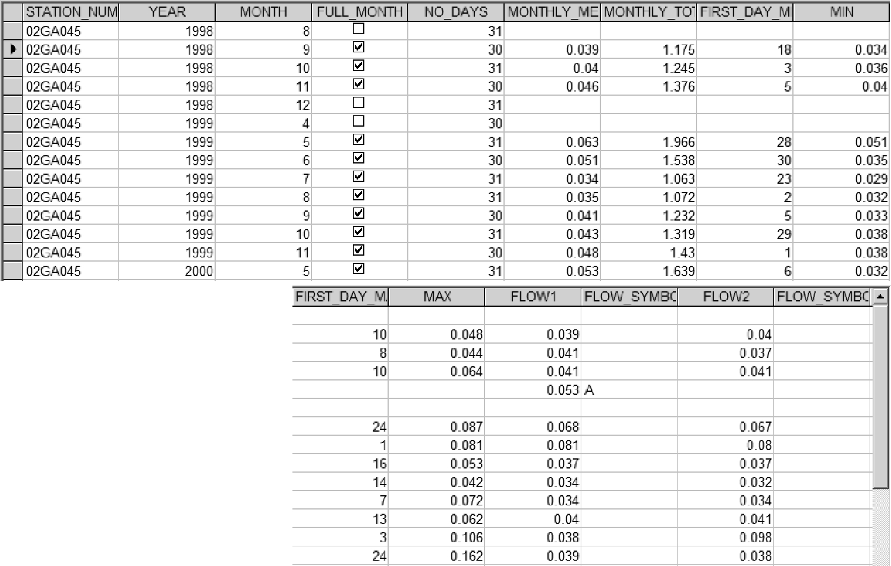
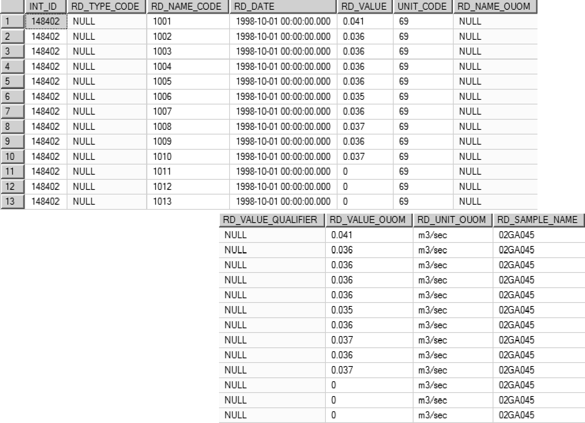

## Section 2.3.9 HYDAT And Spotflow Data

#### HYDAT Data

Source HYDAT information is available from Environment Canada as a Microsoft Access database; from this, daily flow rates can be extracted from the DLY_FLOWS table.  However, this table is found to be in 'spreadsheet' (i.e. column-centric) format.  All information for a particular month is found on a single row with days-of-the-month identified as 'FLOW1' (for the first day of the month), 'FLOW2' (for the second day of the month), etc... (to a 'maximum' day identifier of 'FLOW31' for the applicable months), as shown.

*Figure 2.3.9.1 HYDAT source data*

Here, the STATION_NUMBER identified is '02GA045'; this maps to both a location and interval identifier in the database as well as, being a 'surface water station', a surface water identifier.

* LOC_ID: 149219 (found in D_LOCATION using the STATION_NUMBER identifier; LOC_NAME contains the STATION_NUMBER '02GA045' while LOC_NAME_ALT1 provides the description of the site, i.e. 'HUNSBURGER CREEK NEAR HAY')
* INT_ID: 148402 (found in D_INTERVAL using either the LOC_ID or the STATION_NUMBER identifier; INT_NAME contains the STATION_NUMBER '02GA045')
* SW_ID: -1705149048 (found in D_SURFACEWATER using the LOC_ID)

The latter contains both HYDAT stations (indicated as 'Active' or 'Inactive') as well as locations of spotflow measurements (indicated as 'Local Station'); this information is available in the field 'SWStationComment'.

The actual temporal data (i.e. the values in FLOW1 through FLOW31) are stored in the D_INTERVAL_TEMPORAL_5 table, as shown.

*Figure 2.3.9.2 HYDAT data stored in D_INTERVAL_TEMPORAL_5*

The original-source values are found in the fields

* RD_VALUE_OUOM (the flow rate, e.g. '0.041'; as found in the original FLOW* fields)
* RD_UNIT_OUOM (the flow rate units-of-measure, e.g. 'm3/sec'; note that this specified unit should match a UNIT_DESCRIPTION in the R_UNIT_CODE table)
* RD_SAMPLE_NAME (the STATION_NUMBER has been placed here; this can be used as a check)
* RD_DATE (the date-time at which the RD_VALUE_OUOM is considered to be representative; this would be assembled from the source YEAR, MONTH and FLOW* count)
* INT_ID (associates the Hydat STATION_NUMBER, as found through D_LOCATION and D_INTERVAL, to the particular row of data)

Note that the RD_NAME_OUOM field should be populated with 'Stream Flow - Daily Discharge (Average)' (not shown here), specifying the 'type' of measurement being stored.  The fields that would subsequently be populated with the appropriate 'system' codes (usually by SiteFX) include

* RD_NAME_CODE (using either of R_RD_NAME_CODE or R_READING_NAME_ALIAS, maps the RD_NAME_OUOM to the appropriate reference code; here '1001')
* UNIT_CODE (using R_UNIT_CODE, maps the RD_UNIT_OUOM to the appropriate reference code; here '69')
* RD_VALUE contains a copy of the value from RD_VALUE_OUOM (no conversion being necessary; refer to R_UNIT_CODE and R_UNIT_CONV)

#### Baseflow Data

As of Dated Version 20170922, baseflow estimations are no longer stored in the
database.  These are calculated on-the-fly using applications found on the ORMGP website.

#### Spotflow Data

These locations are stored/found in the ORMGP database much as the 'Hydat
Stations', above.  Under SW_COMMENT (in D_SURFACEWATER) however, 'Spotflow'
locations are indicated with a 'Local Station' tag or a value of '3' for
SW_SUBTYPE_CODE.

Usually, this information consists of single readings at a particular location.  These values are also stored in D_INTERVAL_TEMPORAL_5 with slight differences to that of the 'Hydat' data, above.

*Figure 2.3.9.3 Spotflow data stored in D_INTERVAL_TEMPORAL_5*

Here, the following apply

* RD_NAME_OUOM is identified as a 'Stream Flow' (this name should match the reference information in R_RD_NAME_CODE or R_READING_NAME_ALIAS)
* RD_UNIT_OUOM records the 'Stream Flow' in 'm3/s'; this value should match the reference information in R_UNIT_CODE
* RD_NAME_CODE is mapped to the reference code for 'Stream Flow' (i.e. '70870') in R_RD_NAME_CODE
* UNIT_CODE is mapped to the reference code for 'm3/s' (i.e. '24') in R_UNIT_CODE
* RD_VALUE contains a copy of the value from RD_VALUE_OUOM (no conversion being necessary; refer to R_UNIT_CODE and R_UNIT_CONV)

