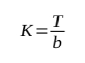
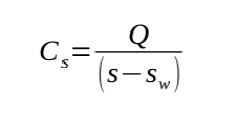
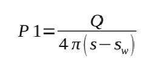
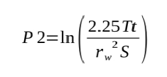
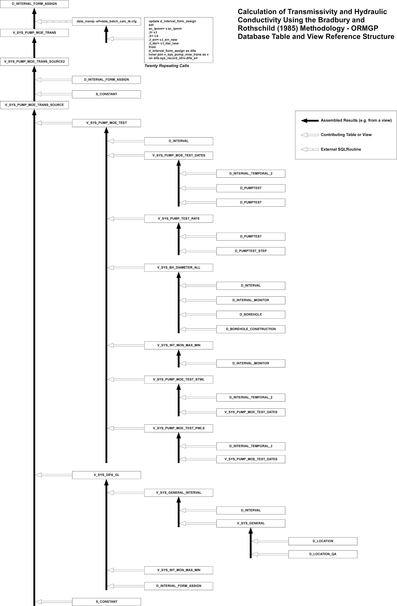

{ r setup, include=FALSE}
knitr::opts_chunk$set(echo = TRUE)

---

## Section 2.4 Secondary (or Derived) Data Relationships

In addition to the primary data that is incorporated into the database (as discussed in the previous section), there are also several interpreted or derived data sets held within the database.  

## Section 2.4.1 Formation Assignment

This D_INTERVAL_FORM_ASSIGN and D_INTERVAL_FORM_ASSIGN_FINAL tables have been created within the database to provide a linkage between any borehole screen (interval) or soil sample (interval) and the geologic formation that it can be associated with.  In this way any temporal data (e.g. chemistry, pumping rates, water levels, etc...) from any screen can be grouped by geologic formation.  Note that this table is not currently accessed from within the SiteFX software.  An older version of this table, D_INTERVAL_FORMATION_ASSIGNMENT, and its associated look-up table R_FORM_MODEL_CODE has been kept for historical comparison (these tables are otherwise no longer accessed).  Refer to an earlier version of this database manual for a description of the methodology for population and interaction with D_INTERVAL_FORMATION_ASSIGNMENT.

The D_INTERVAL_FORM_ASSIGN table contains information regarding the assignment of any number of geologic models to a particular interval (e.g. screen, soil sample, etc...).  A final, best-choice geologic unit is selected from amongst those available and stored in D_INTERVAL_FORM_ASSIGN_FINAL (this is then accessed through multiple views and summary tables).  This (final) interpretation of the assigned geologic unit is often made difficult because there are many geological models or interpretations that have been made over the years within the ORMGP study area.  

The geological models that have been evaluated in assigning the screen to a formation include:

* Core Model (CM2004)
* Web Model (2018)
* Web Model (2021)
* York Tier 3 Model (YT32011)

Other older models are available but have not been incorporated, to date, due to the expectation of updates for these models (e.g. Durham Region).  Information on these individual models is documented elsewhere.  Additional models will be included in this table as they become available (as necessary).

The format of this table has changed significantly from the previous versions of the database (refer to YPDT-CAMC, 2014 - for example - for additional details).  An additional look-up table, R_FORM_ASSIGN_CODE, is used in conjunction with D_INTERVAL_FORM_ASSIGN.  This contains a numeric code for each geologic model that could be represented in the database (including those listed above).  

The D_INTERVAL_FORM_ASSIGN table includes the following fields whose purpose should be explicitly defined.  Note that all geologic unit codes refer to those contained in R_GEOL_UNIT_CODE.

* ASSIGNED_UNIT is the geologic unit, for this particular geologic model to which the interval is assigned (see FORM_MODEL_CODE)
* FORM_MODEL_CODE identifies the geologic model to which this record for this interval applies (where there will be one record for each interval for each geologic model being examined)
* SLAYER is the surficial geologic unit for this location/interval.
* TLAYER is the geologic unit in which the top of the interval lies
* BLAYER is the geologic unit in which the bottom of the interval lies
* PLAYER is the previous/upper geologic unit above the top of the interval
* PLAYER_VDIST is the distance from the top of the interval to the top of the previous geologic unit
* TNLAYER is the next geologic unit down from the top of the interval
* TNLAYER_VDIST is the distance from the top of the interval to the top of the next geologic unit (down from the top of the interval)
* NLAYER is the next geologic unit down from the bottom of the interval
* NLAYER_VDIST is the distance from the bottom of the interval to the top of the next geologic unit (from the bottom of the interval)
* BPLAYER is the previous geologic unit up from the bottom of the interval
* BPLAYER_VDIST is the distance from the bottom of the interval to the top of the previous geologic unit (from the bottom of the interval)
* THICKNESS_M is the thickness of the geologic unit (normally an aquifer) to which this interval has been assigned (as stored in ASSIGNED_UNIT)

Additional fields and their usage are defined in Section 2.4.5.  Each combination of INT_ID and FORM_MODEL_CODE will result in a separate record for each interval.  Only locations/intervals that fall within the spatial extent of any geologic model can be assigned a unit from that model.  

The ASSIGNED_UNIT in D_INTERVAL_FORM_ASSIGN is populated using the following steps (as found in V_SYS_DIFA_GL_ASSIGN).

* if the top and bottom of the interval is within the same geologic unit, that geologic unit is assigned (regardless of whether the unit is considered an aquifer or aquitard)
* if both top and bottom geologic units are aquifers, the geologic unit most exposed to the interval is assigned (based upon the appropriate *_VDIST fields)
* if only one of the top and bottom geologic units is an aquifer, the aquifer geologic unit is assigned
* if the TNLAYER is an aquifer then that geologic unit is assigned (i.e. the aquifer intersects the interval below the top and above the bottom of the interval)
* if BPLAYER_VDIST is greater than TNLAYER_VDIST then the BLAYER geologic unit is assigned
* if TNLAYER_VDIST is greater than BPLAYER_VDIST then the TNLAYER geologic unit is assigned
* if the NLAYER_VDIST is null and the TNLAYER and BPLAYER geologic units match then then TNLAYER geologic unit is assigned
* if the BLAYER matches BPLAYER then the BLAYER geologic unit is assigned
* a NULL value is assigned (which designates that this interval should be examined)

The D_INTERVAL_FORM_ASSIGN_FINAL also includes fields whose use should be explicitly defined.

* ASSIGNED_UNIT, in this case, is the appropriate 'final' (or 'best') geologic unit that should be associated with this interval based upon the geologic models represented in D_INTERVAL_FORM_ASSIGN (see OVERRIDE_UNIT for an exception)
* OVERRIDE_UNIT is the geologic unit which should be assigned to this interval; if populated, this field will take precedence over any geologic unit found in D_INTERVAL_FORM_ASSIGN; values should be assigned to this field only until an appropriate geologic model is representative for this interval at which point the field should be set to NULL
* MANUAL_UNIT is the geologic unit which has been defined for this interval by some trusted, external source (e.g. a high-quality consultant report) - either of the DATA_ID or FINAL_COMMENT fields should indicate this source; this is for reference or historical purposes only (and can be used to temporarily populate OVERRIDE_UNIT)

The ASSIGNED_UNIT for D_INTERVAL_FORM_ASSIGN_FINAL is populated in the following order of preference (as found in V_SYS_DIFAF_ASSIGN):

* if there is an OVERRIDE_UNIT geologic unit, that value is used
* if there is a YT32011 geologic unit, that value is used
* if there is a EM2010 geologic unit, that value is used (not currently defined)
* if there is a DM2007 geologic unit, that value is used (not currently defined)
* if there is a CM2004 geologic unit, that value is used
* if there is a ECM2006 geologic unit, that value is used (not currently defined)
* if there is a RM2004 geologic unit, that value is used (not currently defined)
* if there is a WB2021 geologic unit, that value is used
* if there is a WB2018 geologic unit, that value is used

Once additional geologic models are available, the assignment logic is that the most recent interpretation will be used in assigning a geologic unit to an interval.

In some cases (see Section 2.7), an interval can be associated with multiple depths (with regard to the D_INTERVAL_MONITOR table).  In these cases it is assumed that the multiple depths are associated with more than one open screen in a single borehole casing, that is, there is solid 'blank' casing (in some cases many metres of 'blank' casing) between the open screened sections.  For these screens, the shallowest and deepest values are taken to populate the D_INTERVAL_FORM_ASSIGN table (using the described, above, steps; see V_SYS_INT_MON_MAX_MIN for details).  

There are a number of views within the database that ease the access to the contents of this table (by interval, location and geologic model).  Refer to the V_SYS_DIFA_GL_* views for additional details.

## Section 2.4.2 Elevations

***Location Elevation***

The base table for elevations is now D_LOCATION_SPATIAL_HIST which now closely ties an elevation to a particular coordinate (with the preferred elevation to be used for any location stored as in LOC_ELEV).  A change in either of coordinates or elevations results in a new record in this table.  The D_LOCATION_SPATIAL table indicates the current coordinates and elevation (as well as the relevant quality codes) for a location.  A separate view - V_SYS_LOC_COORDS - can be used for accessing this information and carries the ASSIGNED_ELEV field (a copy of the value in LOC_ELEV) for historic purposes (i.e. many other views are hard-coded to use this field name for elevation).

The D_LOCATION_SPTIAL_HIST table, then, maintains elevation values for each location derived from various sources over the lifetime of the database and resolves issues with respect to changes in elevation for any particular location.  

Previously, individual locations had stored their elevations in various tables dependent upon their location type; elevations would then be found in, originally, each of D_BOREHOLE, D_CLIMATE and D_SURFACEWATER.  The elevation values found in these tables should now be considered as 'historical' information and no longer used.

With regards to boreholes, these elevations have been a source of confusion over the years as the Ministry formerly assigned manual elevations but stopped doing so sometime in the early 1990s, creating a discrepancy when importing the MOE water well database.  Initially (in previous versions of the database) only wells that had no elevation were assigned a DEM elevation.  This has now changed and all boreholes are now assigned a DEM elevation.  Elevation is a critical value in the database as both geologic picks and water levels are inherently related to the surface elevation of the borehole.

The following elevation types are found within the D_LOCATION_SPATIAL_HIST table (and identified by their LOC_ELEV_CODE; refer also to R_LOC_ELEV_CODE for details):

* Surveyed (1); this indicates that a surveyed elevation are available for the particular location (this is indicated by having a value of '1' in the QA_ELEV_CONFIDENCE_CODE field in D_LOCATION_QA; refer to D_LOCATION_QA in Section 2.1); note that the LOC_ELEV_SURVEY field indicates any additional surveyed locations (these will tend to focus on particular boreholes or projects)
* Original (2); for historical purposes only; this indicates the original values found in the BH_GND_ELEV field in D_BOREHOLE which have, largely, come from the MOE; in addition, due to the method by which SiteFX handles elevations in the D_BOREHOLE table, this field will contain the original elevation entered by a user (converted, as necessary, to 'masl') as found in D_BOREHOLE in the BH_GND_ELEV_OUOM and/or BH_GND_ELEV_UNIT_OUOM fields
* DEM - MNR 10m v2 (2); the Digital Elevation Model from the Ministry of Natural Resources, version 2, having a 10m cell size (Ontario Ministry of Environment, 2006)); note that this is only populated for locations that are found within the ORMGP study area (with a 10km buffer)
* DEM - EarthFX 2009-2010 (4); for historical purposes only; this indicates the original values found in the BH_DEM_GND_ELEV field in D_BOREHOLE at the time of the migration to SQL and transfer of database from EFX to the ORMGP group in September 2010; these were assigned, originally, from various DEM sources as the database evolved after 2001 (the source of the DEM assigned to any particular well/group of wells is not well documented); these elevations were provided by EarthFX; new locations will not have an elevation of this type
* DEM - SRTM 90m v41 (5); the Digital Elevation Model from the Shuttle Radar Topography Mission, version 4.1, 90m cell size (Jarvis et al., 2008); note that this field is populated for all locations
* DEM - Bathymetry of Lake Ontario, GEODAS Version 4.1 (6); the bathymetry of Lake Ontario from NOAA (Virden, W.T., et al., 2000)
* DEM - MNR 10m v2 - Replaced (7), DEM - SRTM 90m v41 - Replaced (8) and Surveyed - Previous (9); these codes were used for a short period of time for tracking elevation changes (for the pertinent datasets) due to shifting coordinates; this was subsequently determined to be impractical (i.e. allowing only a single update) and remains for historical reasons only
* Surveyed - Durham Update (10) and Surveyed - TRCA Update (11); these are tied to particular updates related to elevations source directly from either the Durham Region or the TRCA; in both cases, these have been assigned a QA_ELEV_CONFIDENCE_CODE of '1' to avoid any subsequent changes
* Manual Modification (12); this code should be used for all subsequent individual changes that are due to (mainly) coordinate update; users should refer to LOC_ELEV_METHOD and LOC_ELEV_COMMENT

Additional types may be available in the future.  Note that changes of the schema of the database allow multiple records with the same LOC_ELEV_CODE (which wasn't possible) which negates the use of codes '7', '8' and '9' as outlined above.  The 
historical values found in this table are held, in the main, for reference only and for back-checking irregular elevations for picks or water levels (for example).  

The elevation value in LOC_ELEV is meant to reflect the most accurate and up-to-date value for the particular location and is therefore the elevation value that should be used.  Elevations of existing and new locations are assigned from one of three possible values:

* If there is a surveyed elevation, that value is used (usually the most recent as recorded in LOC_ELEV_DATE)
* If the location is within the  ORMGP study area (and buffer), the MNR DEM v2 value is used
* If the location is outside of the ORMGP study area but within Ontario, the SRTM DEM v4.1 value is used
* If the location is outside of Ontario, no value is assigned (and the location may not be present in the table; these should  have a QA_COORD_CONFIDENCE_CODE of '117', refer to R_QA_COORD_CONFIDENCE_CODE for details)

Note that SiteFX does not use the D_LOCATION_SPATIAL_\* tables.  Instead, SiteFX uses a combination of the BH_GND_ELEV, BH_GND_ELEV_OUOM (as well as BH_GND_ELEV_UNIT_OUOM) and BH_DEM_GND_ELEV.  The BH_GND_ELEV is populated by the BH_GND_ELEV_OUOM field (with the appropriate conversion from the specified units) except in the case when a QA_COORD_CONFIDENCE_CODE of '10' (i.e. the elevation is from a DEM) is assigned.  In the latter case, the BH_GND_ELEV is populated from the BH_DEM_GND_OUOM field.   In addition, the current Viewlog 'header' files also access the D_BOREHOLE table for elevations.

To prevent issues, then, the LOC_ELEV from D_LOCATION_SPATIAL (this points to the value found in D_LOCATION_SPATIAL_HIST) should be copied into each of the BH_GND_ELEV, BH_GND_ELEV_OUOM and BH_DEM_GND_ELEV fields.  Note that any existing value here should already have been captured in the D_LOCATION_SPATIAL_HIST table (and classified appropriately; otherwise this would be an 'original elevation').  Refer to Appendix G for details regarding the ORMGP routine checks and procedures for synchronizing these sets of elevation tables.

Partners should preferentially use the value reference in D_LOCATION_SPATIAL as it is intended that reliance upon D_BOREHOLE for storing elevations will be depreciated in the future.

Note that in some cases a QA_COORD_CONFIDENCE_CODE of '117' has been applied to locations outside of the ORMGP study area but within Ontario.

***Interval Reference Elevation***

Interval reference elevations are points against which water levels elevations are calculated.  Most water levels are initially measured in depths, as meters-below-ground-surface ('mbgs') or meters-below-top-of-casing ('mbtop' or 'mbtoc'; refer to R_UNIT_CODE and R_UNIT_CONV for additional examples).  In the database, these elevations would then be converted to an actual elevation (i.e. 'masl') based upon the reference elevation stored in D_INTERVAL_REF_ELEV.  These are linked through the INT_ID field to the D_INTERVAL table.

The database was not initially designed to specifically house the stickup height, that is, the height of a measuring pipe above the ground surface.  Rather, if needed, the stickup height was to be determined by subtracting the ground elevation from the reference elevation for any interval in the database.  It is now thought that storing the actual stickup, that is related to any given REF_ELEV (in D_INTERVAL_REF_ELEV) would be advantageous - a mostly unused field REF_POINT has been co-opted for this purpose.  A REF_STICK_UP field has been added to D_INTERVAL_REF_ELEV to capture this information - this numeric value should match that in REF_POINT (both of these should only be metres).  In addition, recent versions of SiteFX have included a REF_OFFSET, REF_OFFSET_OUOM and REF_OFFSET_UNIT_OUOM fields to also capture this information.  Each of REF_POINT, REF_STICK_UP and REF_OFFSET (optimally) should match.  If the REF_POINT does not match, this is assumed to reflect an update 

In cases where no REF_ELEV value has been supplied, a default value of ground surface plus 0.75m has been assigned and a suitable comment made in the REF_COMMENT field.  Where the REF_ELEV_COMMENT field refers to the water levels as being measured from the ground (i.e. flushmount casing) then the stickup is assigned a zero value and the REF_ELEV field is taken from LOC_ELEV (in the D_LOCATION_SPATIAL table).

### Section 2.4.3 Geologic Picks

The D_PICK (previously PICKS) table holds the 'geologic' picks that are (in almost all cases) made from within the Viewlog software package.  When viewing in cross-section mode, Viewlog allows the elevation of any geological formation top, at any well location, to be written back into the database.  These 'picks' are tied back to the borehole location through the LOC_ID (automatically populated into the D_PICK table at the time a 'pick' is made).  These 'picks' therefore represent the most up-to-date geological interpretation and are used to kriging/interpolation of the geological surfaces across the study area.  

Since the beginning of the ORMGP program, these 'picks' (in the D_PICK table) have been continually updated.  This means that if a new or slightly different geological interpretation is put forward, the existing picks could potentially be deleted from the picks table and replaced with a new pick at a different elevation.  The D_PICK table has been backed up on a regular basis (over the past 10 years) in the case that a check against an older interpretation of the geology is required.

A new table (as of 2022-01-20), D_PICK_EXTERNAL, allows incorporation of
'picks' from alternate sources without having to associate a pick with a
specific location (i.e. using a LOC_ID).  Instead, the coordinate and 
elevation information as well as the QA information is captured for each pick.  
In addition, polyline and polygonal information can be stored with additional
ancillary information.  Refer to Section 2.1.1 for details.

### Section 2.4.4 Baseflow Estimation

The baseflow estimation for surface water flow gauges was another interpreted data set previously held in the database.  These have been removed as of Database dated version 20160831.20170922 (refer to D_VERSION_CURRENT).  Instead, these values can be calculated on-the-fly on the ORMGP website.

### Section 2.4.5 Specific Capacity, Transmissivity and Hydraulic Conductivity

The database holds specific capacity values previously found in the MOE WWDB (likely prior to the 'mdb' - i.e.  Microsoft Access - distributions) - these are historic only and are no longer maintained.  In addition, specific capacity values may be incorporated at any time from (for example) reports or new wells.  Both of these sets of values will be found in D_INTERVAL_TEMPORAL_2 (with a RD_NAME_CODE of '748').

For MOE WWDB locations a view has been created to calculate specific capacity on-the-fly - V_SYS_SPEC_CAP_MOE_CALC.  This relies upon V_SYS_PUMP_MOE_TEST as the source of data upon which the calculation is based and requires that the change in elevation (i.e. between the static water level and pumping drawdown water level) be non-negative (indicative of problematic data) and non-null as well as having a non-zero pumping rate value.  The latter view (V_SYS_PUMP_MOE_TEST) has its own set of requirements and draws from a number of source views (and tables) as follows:

* D_INTERVAL
* V_SYS_BH_DIAMETER_ALL
* V_SYS_INT_MON_MAX_MIN
* V_SYS_MOE_TEST_DATES
* V_SYS_PUMP_MOE_TEST_STWL
* V_SYS_PUMP_MOE_TEST_PWLS
* V_SYS_PUMP_TEST_RATE

Pumping rates are converted to litres-per-minute, the borehole diameter/radius is converted to metres and the pumping duration is assumed to be fifteen minutes unless otherwise specified (a common MOE standard).  If specified, long durations that are considered problematic are set to NULL values.  The resultant calculated values are not stored.  

The previous procedure does not take into account partial penetration of the aquifer system.  A methodology developed by Bradbury and Rothschild (1985) is implemented within the database (using a series of views) that determines transmissivity using a recursive calculation, repeating until the value falls below a default error of '0.000001' m2/s (between calculations) as specified by DEF_TRANSMISSIVITY_ERR in S_CONSTANT.  Both specific capacity and hydraulic conductivity are also calculated.

The view V_SYS_PUMP_MOE_TRANS is used to perform the calculations which, in turn, calls each of V_SYS_PUMP_MOE_SOURCE2 and V_SYS_PUMP_MOE_SOURCE.  As a check, companion views - V_SYS_PUMP_MOE_TRANS_BR1985, V_SYS_PUMP_MOE_SOURCE2_BR1985 and V_SYS_PUMP_MOE_SOURCE - have been created that mimic the methodology but use the original values (stored in S_CONSTANT) provided in the Bradbury and Rothschild (1985) paper.  These latter views use the INT_ID '-2147483535' (mapping to the default Viewlog header location) as a proxy interval.  These are used to check that the methodology within the database reproduces the estimates contained in the two example calculations in Bradbury and Rothschild (1985).  In addition to the views, the D_INTERVAL_FORM_ASSIGN table is used as a source as well as containing the fields where the calculated values are ultimately stored.  Note that there will be one set of values (by INT_ID) for each geologic model that is incorporated.

***Methodology - Bradbury and Rothschild (1985)***

The equation assembled by Bradbury and Rothschild (1985; subsequently referred to as BR1985) is of the form

where:	
* T is Transmissivity (m2/s)
* Q is Pumping Rate (litres-per-minute [m3/s])
* s is the Drawdown (m)
* sw is the non-linear (turbulent) Well Loss (m)
* t is the Pumping Duration (s)
* rw is the Well Radius (m)
* S is the Storage Coefficient (unitless; defaults to 1x10-5 - Kassenaar and Wexlar, 2006)
* sp is the Partial Penetration Factor (unitless).

The Well Loss is calculated by

where:	
* C is the Well Loss Constant (BR1985 defaults to 380.121905 s2/m5)

The Partial Penetration Factor is calculated by

where:	
* L is the Screen Length (m)
* b is the Aquifer Thickness (m)
* G{L/b} is a fitted polynomial equation (with an R of 0.992) of the form

Hydraulic Conductivity is then calculated from Transmissivity by

where:	
* K is Hydraulic Conductivity (m/s)

Note that the Specific Capacity, in this methodology, is calculated through

where: 
* Cs is Specific Capacity (m/s)

To ease the complexity of the views, these calculations are divided into three components

with the final calculation, then, of the form

***Methodology - Bradbury and Rothschild (1985) - Implementation***

The first sourced view, V_SYS_PUMP_MOE_TRANS_SOURCE, pulls information from V_SYS_PUMP_MOE_TEST and V_SYS_DIFA_GL.  The latter assembles the current top- and bottom-formations (i.e. the formation that occurs at each of the top or bottom of the screen interval) as well as tagging them if they are aquifers (any of Oak Ridges Aquifer Complex/Mackinaw Interstadial, Thorncliffe Formation, or Scarborough Formation for the ORMGP study area), the aquifer thickness (if either are tagged) and the length at which the screen intersects the aquifer.  The elevation of the top and the bottom of the interval must be non-null.  V_SYS_PUMP_MOE_TEST pulls the pumping, water levels and interval information (including the diameter) from a variety of sources.   A number of checks are implemented here: drawdown cannot be null and must be greater than zero; the pumping rate cannot be null; the well radius cannot be null; the number of minutes of pumping cannot be null and must be greater than zero; the aquifer thickness must be greater than zero.  The DEF_STORATIVITY ('0.00001') and DEF_WELL_LOSS ('380.121905') values from S_CONSTANT are used here.  The calculations for P3 occur here.

The second sourced view, V_SYS_PUMP_MOE_TRANS_SOURCE2, uses the first as a source as well as pulling information from D_INTERVAL_FORM_ASSIGN.  The table is a special case as it will hold intermediate values while the process is repeatedly called.  In particular, calculations will be made if T_ITER (i.e. the current transmissivity iteration count) is null and T_ERR (i.e. the previously calculated error between succeeding transmissivity values) is also null.  Alternatively, if the number of T_ITER is less than the maximum number of iterations allowed (determined by DEF_TRANSMISSIVITY_MAX_ITR) and the T_ERR value is less than the minimum error allowed (specified by DEF_TRANSMISSIVITY_ERR) then a new calculation will be made.  Note that for the first calculation a default transmissivity value is assumed (as set by DEF_TRANSMISSIVITY_EST - currently a value of '0.1'; each of these default values are found in S_CONSTANT).  In another process, namely that of populating or modifying D_INTERVAL_FORM_ASSIGN, the T_ITER and T_ERR fields are cleared to signify that new calculations need to be made (usually due to a coordinate or elevation update for example).

The table (D_INTERVAL_FORM_ASSIGN) also stores the aquifer thickness as well as the currently calculated T (transmissivity), K (hydraulic conductivity) and SC_LPMM (specific capacity) values.  For every calculation, these fields are updated along with the current calculated error (stored in T_ERR); the T_ITER value is incremented by one.  The V_SYS_PUMP_MOE_TRANS_SOURCE2 view calculates the numerator and denominator for P2 as well as the denominator for P1.

The final view, V_SYS_PUMP_MOE_TRANS, performs the final calculation for transmissivity (i.e. using P1, P2 and P3) as well as calculating each of K, SC_LPMM, T_ERR and T_ITER.  Note that the TRANS_EST value is either the previously calculated T (from the previous iteration) or the DEF_TRANSMISSIVITY_EST value.  The only check made here is to avoid divide-by-zero errors or to calculate negative values - each of the numerators and denominators must be greater than zero.

Refer to Figure 2.4.5.1 for details.

*Figure 2.4.5.1 ORMGP Database Tables and Views Reference Structure for
Hydraulic Conductivity and Transmissivity Calculation.*

