## Appendix J.1 Training Exercises (Easy)

#### Example 1a - Wells Associated with Nobleton (Microsoft Access 2003)

As a first example, we will look for all wells that have been associated with Nobleton.

1. Select the 'Queries'  option under 'Objects' and then select 'New'

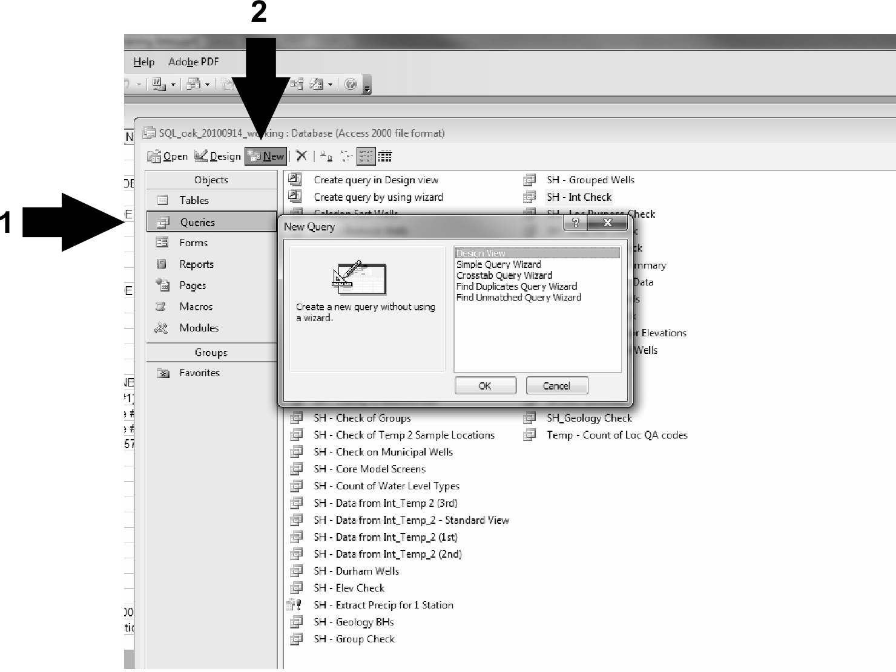
*Figure J.1.1 Microsoft Access 2003 - Select Queries*

2. 'Design View' is automatically selected (in the upper left corner).  Add the 'D_LOCATION' table by double-clicking in the 'Show Table' dialog box (or single-clicking and selecting 'Add')

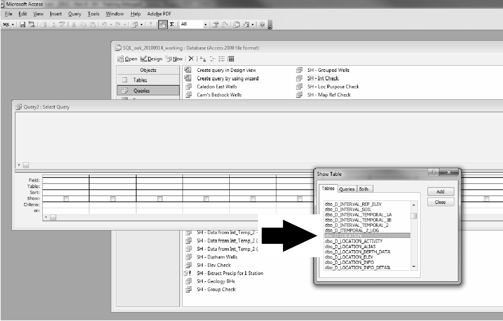
*Figure J.1.2 Microsoft Access 2003 - Add Tables*

3. Add each of the following fields/columns into they query by double-clicking on them (or clicking-dragging) so they appear in the query box:

* LOC_ID								
* LOC_NAME					
* LOC_NAME_ALT1				
* LOC_TYPE_CODE				
* LOC_ORIGINAL_NAME			
* LOC_STUDY
* LOC_COORD_EASTING
* LOC_COORD_NORTHING
* LOC_STATUS_CODE
* DATA_ID

4. Filter the query under the LOC_STUDY field/column by entering 'like "*Noble*"' under 'Criteria'.  Select the red exclamation mark (the 'Run' button) to run the query

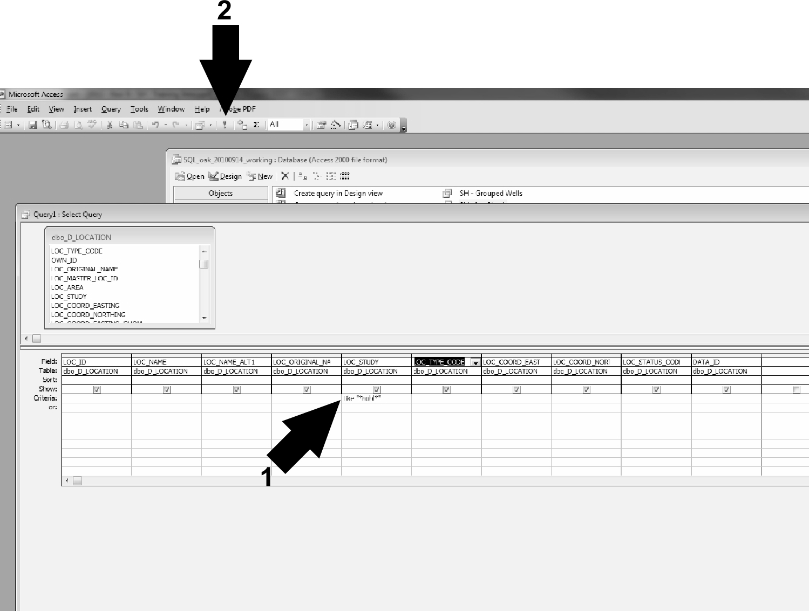
*Figure J.1.3 Microsoft Access 2003 - Filter Query*

5. A number of records should be returned.  They can be sorted by selecting 'LOC_NAME - <right-click> - Sort Ascending' (note that some of the field/column names have not been shown)

*Figure J.1.4 Microsoft Access 2003 - Results*

Note the following:

* The Nobleton Golf Course well also appears in the query
* MW indicates monitoring wells
* PW indicates pumping wells
* Some locations are pumping stations (they have a LOC_TYPE of '10')
* There is no MOE number for some of the wells; an ATag number is used if known

#### Example 1b - Wells Associated with Nobleton (Microsoft Access 2010)

This example mirrors the previous (1a) with screenshots from Microsoft Access 2010.

Select the 'Queries'  option under 'Objects' and then select 'New'

1. The 'Query Design' option is now found under 'Create - Query Design'

*Figure J.1.5 Microsoft Access 2010 - Select queries and add tables*

2. Add the 'D_LOCATION' table by double-clicking in the 'Show Table' dialog box (or single-clicking and selecting 'Add')

3. Add each of the following fields/columns into the query by double-clicking on them (or clicking-dragging) so they appear in the query box:

* LOC_ID						
* LOC_NAME					
* LOC_NAME_ALT1				
* LOC_TYPE_CODE				
* LOC_ORIGINAL_NAME			
* LOC_STUDY
* LOC_COORD_EASTING
* LOC_COORD_NORTHING
* LOC_STATUS_CODE
* DATA_ID

4. Filter the query under the LOC_STUDY field/column by entering 'like "*Noble*"' under 'Criteria'.  Select the red exclamation mark (the 'Run' button) to run the query

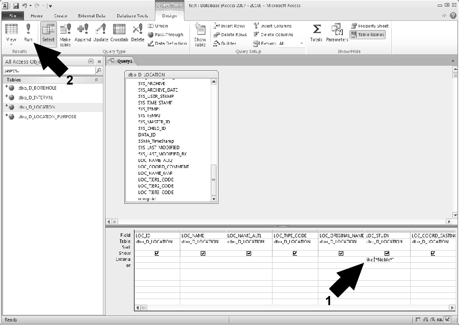
*Figure J.1.6 Microsoft Access 2010 - Filter*

5. A number of records should be returned.  They can be sorted by selecting 'LOC_NAME - <right-click> - Sort Ascending' (note that some of the field/column names have not been shown)

*Figure j.1.7 Microsoft Access 2010 - Results*

6. Note that the method by which to switch between 'Design View', 'SQL View' and 'Datasheet View' has been moved to the lower-right of the Microsoft Access interface.

#### Example 1c - Wells Associated with Nobleton (Microsoft SQL Management Studio - SQL)

A similar design procedure can be accomplished in Microsoft SQL Management Studio through selection of the database (e.g. OAK_20120615_CLOCA) then selecting the 'New Query' button.   Once the blank query is available (make sure that the cursor is within the query window) select 'Query - Design Query in Editor'.  A similar series of options as described above in 'Example 1b' will be presented.  Once the query is finished being built/edited, the user will be returned to the query window where it can then be run.  While the Access version of the query remains as part of the users (Access) database, the query built in Management Studio must be saved as a separate file (with an '.sql' extension).  The latter defaults to working within the SQL language as opposed to the graphic representation found in Access.

An SQL command that accomplishes the task in 'Example 1a' would be of the form:

    SELECT 
     [LOC_ID]
    ,[LOC_NAME]
    ,[LOC_NAME_ALT1]
    ,[LOC_TYPE_CODE]
    ,[LOC_ORIGINAL_NAME]
    ,[LOC_STUDY]
    ,[LOC_COORD_EASTING]
    ,[LOC_COORD_NORTHING]
    ,[LOC_STATUS_CODE]
    ,[DATA_ID]
    FROM [OAK_20120615_CLOCA].[dbo].[D_LOCATION]
    WHERE
    [LOC_STUDY] like '%noble%'
    ORDER BY
    [LOC_NAME]

This would return the same result set found in 'Example 1a'.  There are a few
differences between the two software packages related to formatting: the use
of single quotes as opposed to double-quotes (after 'like'); the use of
percent signs (%) in place of stars (\*) for designating wild-card characters.
Also, the '[OAK_20160831].dbo.' is unnecessary if the user is only dealing with one database.

A similar SQL command can be viewed within Access if the user selects 'View - SQL View' while in the 'Design' mode of the query (instead of in the results).

#### Example 2 - Bedrock Elevations using Views (Microsoft Access 2003/2010)

In this case, we'll use a 'View' within the database from which we'll extract certain pieces of information.  View's in Microsoft SQL Server are used to hide the complexity of linked/joined tables from the user and to provide easier access to information through (for example) the minimization of searching/linking through tables.

Make sure the the view V_GEN_BOREHOLE_BEDROCK has been linked into Access (following the instructions of Section 3.1.1 and 'Example 1a/1b', above).  Note that Access does not distinguish between tables and views, treating the latter as a table.

1. Select the 'Queries' option under 'Objects' and then select 'New'
2. 'Design View' is automatically selected (in the upper left corner).  Add
the V_GEN_BOREHOLE_BEDROCK view by double-clicking in the 'Show Table' dialog box (or single-clicking and selecting 'Add')
3. Add the following columns to the query (by double-clicking or by clicking/dragging): 

* LOC_ID 
* LOC_NAME		
* GROUND_ELEV
* BOTTOM_ELEV
* BEDROCK_ELEV

4. Run the query and note the values returned.  The values themselves are found in various data tables including

* D_LOCATION
* D_BOREHOLE
* D_GEOLOGY_LAYER

The complexity of 'joining' the tables together based on their location is hidden within the view itself.  The definition of 'bedrock' itself is present (and accessed on-the-	fly) from another table - R_GEOL_MAT1_CODE - avoiding the classification of each 	layer in a borehole as bedrock (or not).

5. Now the bedrock elevation doesn't tell us (directly) at what depth bedrock was encountered.  Instead, we need to calculate the bedrock depth based upon the ground and bedrock elevations.  To do so, return to the 'Design View' and right-click in a new/blank 'Field'; select 'Build' from the options.  The 'Expression Builder' dialog box comes up - this allows you to combine fields from the tables you've included in your query.  Use the options and subtract the bedrock elevation from the ground elevation.  

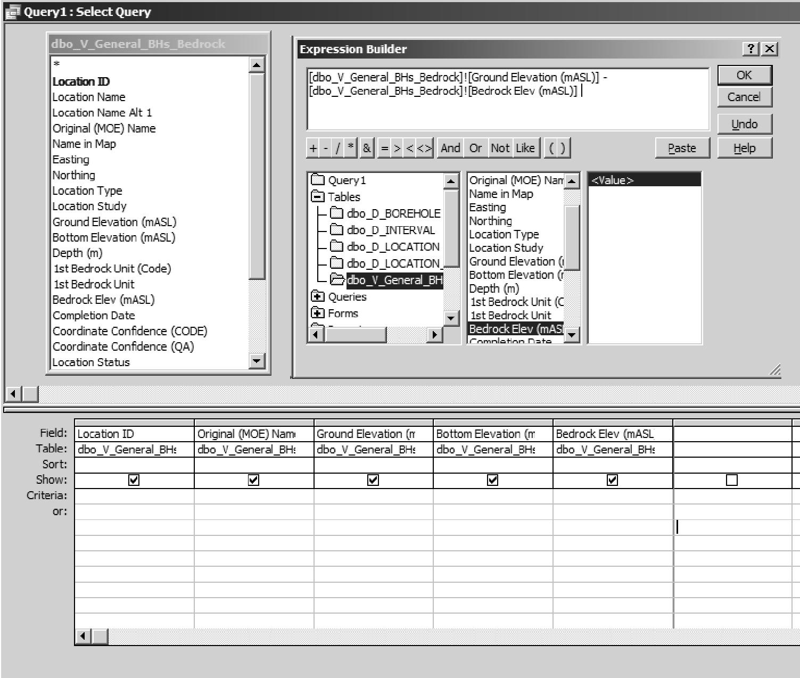
*Figure J.1.8 Microsoft Access 2003/2010 - Expression Builder*

6. Select 'Okay' when finished and change the 'Expr1:' name to 'Bedrock_Depth'.  Re-run the query.  Note that, now, you have new information - namely the depth at which bedrock was encountered.

*Figure J.1.9 Microsoft Access 2003/2010 - Filter*

7. If we, in addition, wanted to see the highest 100 depths at which bedrock was encountered, we can select a 'Sort' for the 'Depth' field - select 'Descending.  To access only the top 100 (deepest), exchange the 'Design View' for the 'SQL View' - this is the actual SQL command that is run to extract the data from the view.  Modify it by adding 'top 10' after the 'select' keyword - rerun the query and note that only 10 records are returned.                                

*Figure J.1.10 Microsoft Access 2003/2010 - SQL Query*

8. The results are shown below 

*Figure J.1.11 Microsoft Access 2003/2010 - Results*

#### Example 3 - Locate all Municipal Wells (using SQL - Access or Management Studio)

To locate all municipal pumping wells, the query would draw from the D_LOCATION table and the D_LOCATION_PURPOSE table, using criteria of 10 (water supply) for the primary water use, and a criteria of 22 (municipal) for the secondary water use.  We also need to extract only boreholes (and not anything else) - this corresponds to a LOC_TYPE_CODE of '1'.  Note that each water use has an end date, allowing chronological tracking of changing well uses with time.  The SQL code would then be:

    SELECT
     DLP.LOC_ID 
    ,DLOC.LOC_NAME 
    ,DLOC.LOC_NAME_ALT1 
    ,DLOC.LOC_COORD_EASTING
    ,DLOC.LOC_COORD_NORTHING 
    FROM 
    D_LOCATION_PURPOSE AS DLP
    INNER JOIN
    D_LOCATION AS DLOC
    ON
    DLP.LOC_ID=DLOC.LOC_ID
    WHERE
    PURPOSE_PRIMARY_CODE=10
    AND PURPOSE_SECONDARY_CODE=22
    AND LOC_TYPE_CODE=1

Note here that we're using 'aliases' of table names to shorten the SQL code required (e.g. DLP for D_LOCATION_PURPOSE).  Refer to Appendix A for a description of the application of SQL with regards to the ORMGP database.

The equivalent query, created in 'Access - Design View', would be similar to

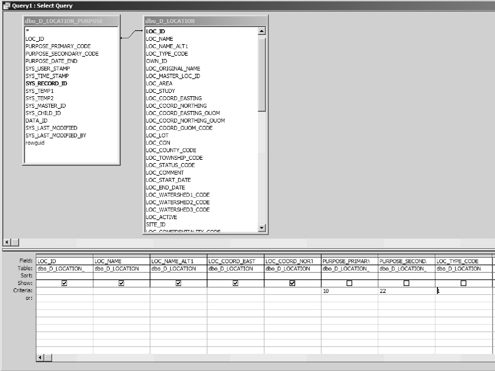
*Figure J.1.12 Microsoft Access - Design View equivalent*

#### Example 4a - Plot Water Levels (using Microsoft Excel 2003)

It has been the case that datasets have been stored across multiple files (typically Access or Excel files) with information being copied-pasted as required for creating a particular one-off dataset.  It is more advantageous to centralize this information (and thereby reducing possible errors during the transferral process) and access it as necessary.  This allows information updates to be rolled into analysis without lengthy modification/reformatting procedures.  When the user revisits the spreadsheet at some point in the future, a refresh of the dataset will cause any new information to be included automatically (refer also the comments at the end of this example).

One primary example of this is the plotting, using Excel, of water level data.  This example assumes that the user has already reviewed Section 3.1.1 (General Database Access) and created the necessary files/odbc-links enabling Excel to communicate with the database.  (Note that the reference version of Excel is 2003.  This example should apply to more recent versions with only slightly different paths for accessing the Excel functions.)

* Start Excel and select 'Data - Import External Data - Import Data'
* Select the previously created database DSN file (refer to Section 3.1.1 for this information)
* Select the V_Temporal_Data view (Excel will treat this as a table; it may be referenced as dbo.V_Temporal_Data)
* Add the data to the existing worksheet

*Figure J.1.13 Microsoft Excel - Import Data*

* Select 'Edit Query' then 'Next'
* Select 'Column To Filter - Screen ID' and add (equal) the INT_ID 149839 (note that his is the ORMGP borehole 294-4 and may not be present in all partner database's; select an appropriate INT_ID if necessary)

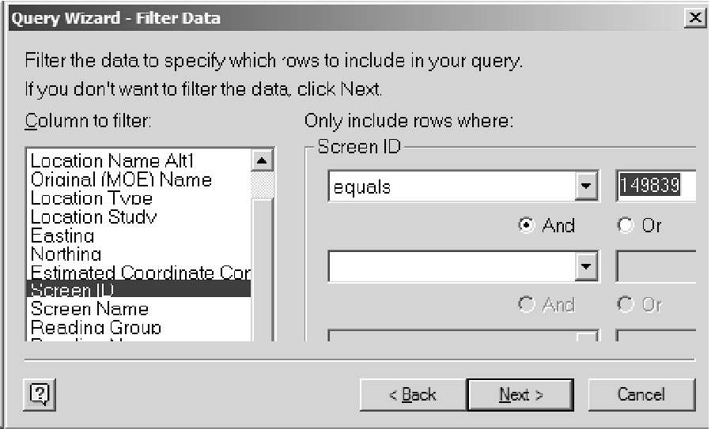
*Figure J.1.14 Microsoft Excel - Filter*

* Select 'Column To Filter - Reading Name' and make it equal to 'Water Level - Logger (Compensated BP)' (note that the text must be exact to match against; refer to R_READING_NAME_CODE if necessary)
* Select 'Next', then 'Sort by - Date'
* Select 'Next', then 'Return Data to Microsoft Excel'

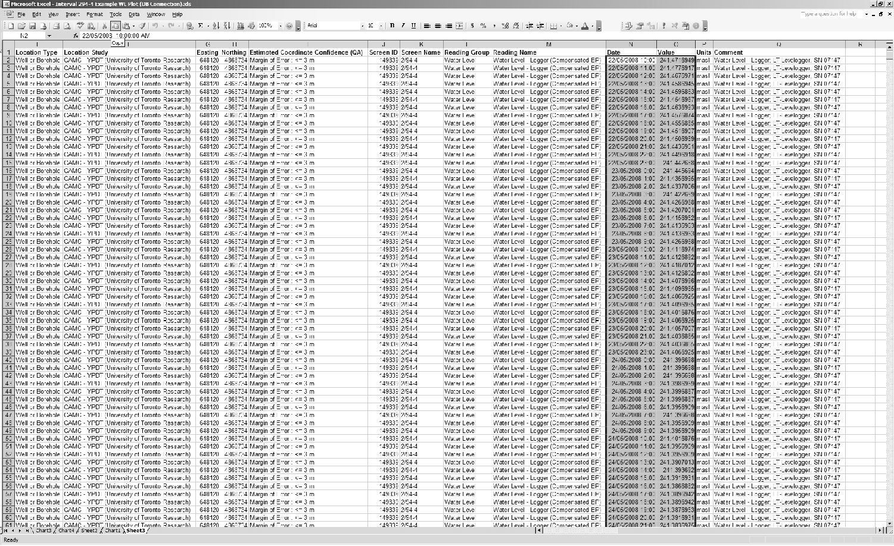
*Figure J.1.15 Microsoft Excel - Results*

* This returns the data set to Excel (the current spreadsheet) where it can, subsequently, be plotted (the description for plotting in Excel is not provided)

*Figure J.1.16 Microsoft Excel - Plot*

A few comments regarding this process

* Depending upon the version of Excel being used, it may be limited to a maximum number of rows (commonly ~32000 or ~65000); if so, the query should be modified (for example, by setting a 10 yr interval on the data, then creating multiple imported dataset to plot against)
* The user can drop unneeded columns from this process thereby reducing the resultant file size
* Plotting of the data requires the user to specify the starting and ending row numbers; however, when (or if) the data is refreshed (so as to automatically update the plot), more (i.e. updated) information may come into the spreadsheet than was originally available when the plot was created; as such, the user will find it necessary to modify the graphs to account for this additional data (by reselecting the extents of the rows/columns) 

#### Example 4b - Plot Water Levels (using Microsoft Excel 2010)

The method for plotting water levels in the updated version of Microsoft Excel is, basically, equivalent to that described in Example 4a (above).  Access to an external data source is enabled through the 'Data - Other Sources' tab.

*Figure J.1.17 Microsoft Excel 2010 - Import Data*

Selecting 'From Microsoft Query' allows the user to select the (previously enabled) database source (through, for example, the 'ODBC Administrator' program).

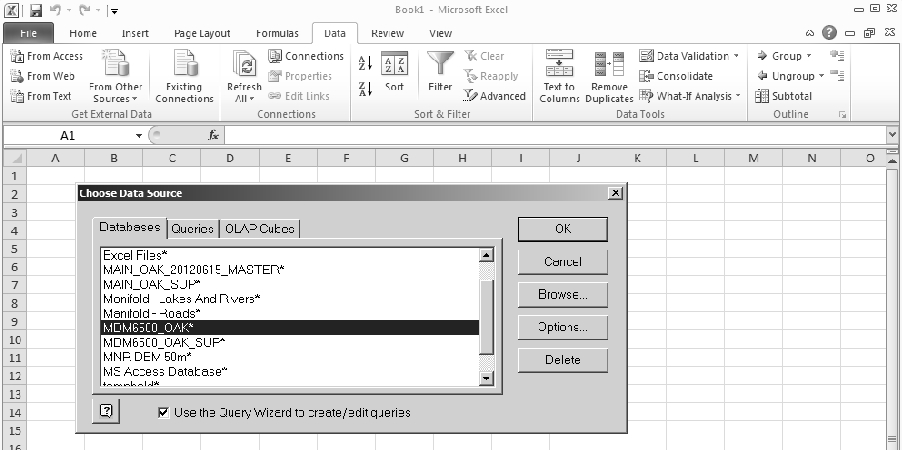
*Figure J.1.18 Microfot Excel 2010 - ODBC Administrator source*

Here the database chosen would be 'MDM6500_OAK'; selecting 'OK' would take the user to the 'Query Designer' window (outlined previously).  

Selecting, instead, the 'From SQL Server' (i.e. a direct connection) allows the user to specify the SQL Server (name) holding the ORMGP partner database.

*Figure J.1.19 Microsoft Excel 2010 - Database Server*

And then select the database and table to import into Excel.

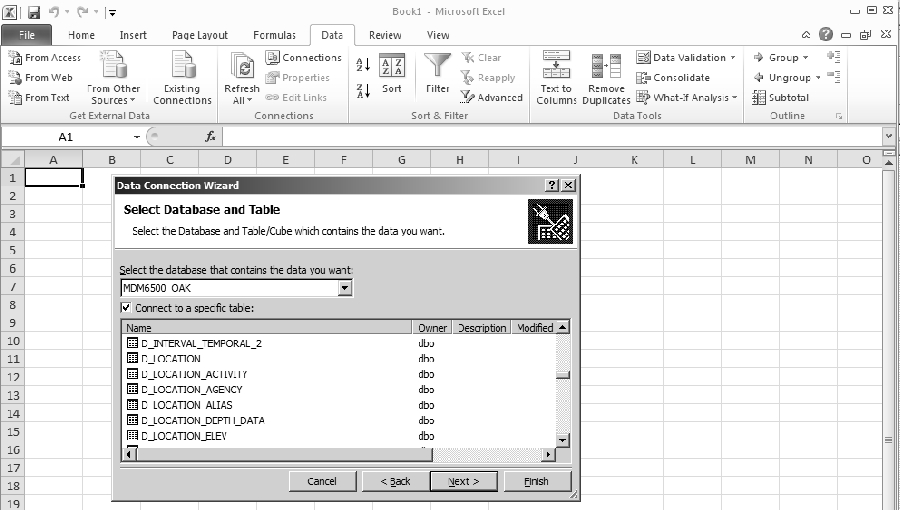
*Figure J.1.20 Microsoft Excel 2010 - Select Databse and tables*

However, note that many of the tables present in the database will have an exceedingly large number of rows (and, potentially, columns) and the entire table would be imported.  Using an alternate method of connecting to the database, allowing the reduction of the number of rows returned through Excel's 'Query Designer' is recommended.

#### Example 5 - Flow Gauge Locations (using SQL - Access or Management Studio)

Flow gauges, as they would record what would be considered as 'temporal' data, are assigned a particular type in the R_INT_TYPE_CODE table (i.e. 'Surface Water Flow Gauge' has a value of '4').  As such, the D_INTERVAL table is the first place to start determining the location of flow gauges.  The SQL command

    SELECT
    *
    FROM
    [OAK_20160831_MASTER].dbo.D_INTERVAL
    WHERE
    INT_TYPE_CODE=4

would return all rows where an 'interval' is identified as a flow gauge.  

*Figure J.1.21 Microsoft SQL Server - Query results*

All columns (here, specified using '\*') would be returned.  In reality, we only need the LOC_ID from this table in order to access the related information from the D_LOCATION table.  We'll now perform a 'relational join' between D_INTERVAL and D_LOCATION to extract the coordinates and names of the flow gauge stations.

    SELECT
     dint.LOC_ID
    ,dint.INT_ID
    ,dloc.LOC_NAME
    ,dloc.LOC_NAME_ALT1
    ,dloc.LOC_COORD_EASTING
    ,dloc.LOC_COORD_NORTHING
    FROM
    D_INTERVAL AS dint
    INNER JOIN
    D_LOCATION AS dloc
    ON
    dint.LOC_ID=dloc.LOC_ID
    WHERE
    dint.INT_TYPE_CODE=4

Note that we're using 'aliases' (with the AS keyword) to shorten the names of the D_LOCATION (i.e. dloc) and D_INTERVAL (i.e. dint) tables.  This would then return the requisite information.

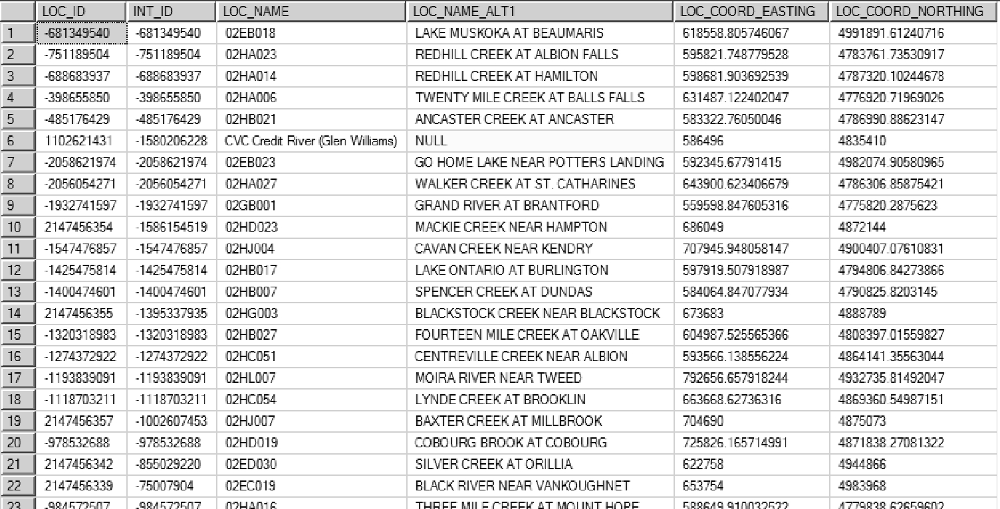
*Figure J.1.22 Microsoft SQL Server - Subset query results*

The equivalent query, created in 'Access - Design View', would be similar to

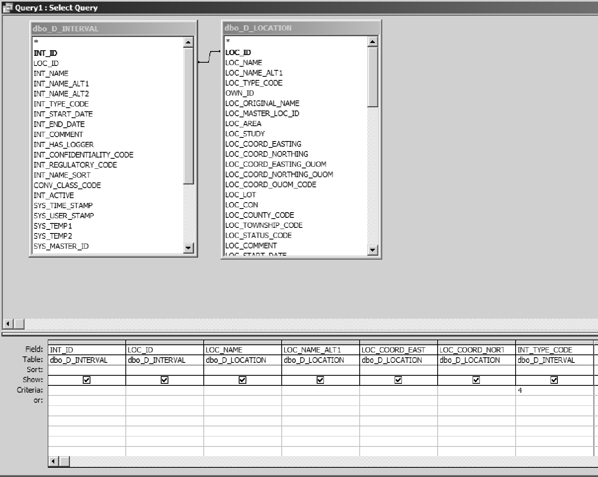
*Figure J.1.23 Microsoft Access - Equivalent query*

#### Example 6 - Bedrock wells with 6 inch casing (using SQL - Access or Management Studio)

This question is somewhat complicated in that multiple tables need to be accessed to produce the result.  These include

* Tables
    + D_LOCATION
    + D_BOREHOLE
    + D_BOREHOLE_CONSTRUCTION

* Views
    + V_GEN_BOREHOLE_BEDROCK

* Fields
    + LOC_ID
    + BH_ID
    + CON_DIAMETER (from D_BOREHOLE_CONSTRUCTION)
    + CON_DIAMETER_OUOM (from D_BOREHOLE_CONSTRUCTION)
    + CON_DIAMETER_UNIT_OUOM (from D_BOREHOLE_CONSTRUCTION)
    + BH_BEDROCK_ELEV (from D_BOREHOLE; an alternate method)

Any wells found in V_GEN_BOREHOLE_BEDROCK, by design, wells in bedrock - the remainder of the required information is found elsewhere.  In this case, the 'V_General_BHs_Bedrock' view and D_LOCATION table need to be linked (based on 'Location ID' and LOC_ID).  This would allow the user to then link to D_BOREHOLE (also based on LOC_ID) in order to determine the BH_ID.  This last piece of information allows the user to link to D_BOREHOLE_CONSTRUCTION (based on BH_ID).  Finally, the content of CON_DIAMETER can be examined looking, initially for a value of '6'.  Note that there is no conversion when copying the borehole diameter from CON_DIAMETER_OUOM to CON_DIAMETER.  A whole number in CON_DIAMETER, for example '6', likely means '6 inches' - CON_DIAMETER_UNIT_OUOM could also be examined as a check.  However, in some cases during data entry, a '6 inch' value could (potentially) have been converted to a width in cm's or m's; for completeness, those values (15.2 and 0.152) should be checked as well.

Note that D_BOREHOLE now contains a BH_BEDROCK_ELEV field.  When non-NULL,
this indicates that the particular borehole has reached bedrock.  This field
can be used instead of involving the view V_GEN_BOREHOLE_BEDROCK.

