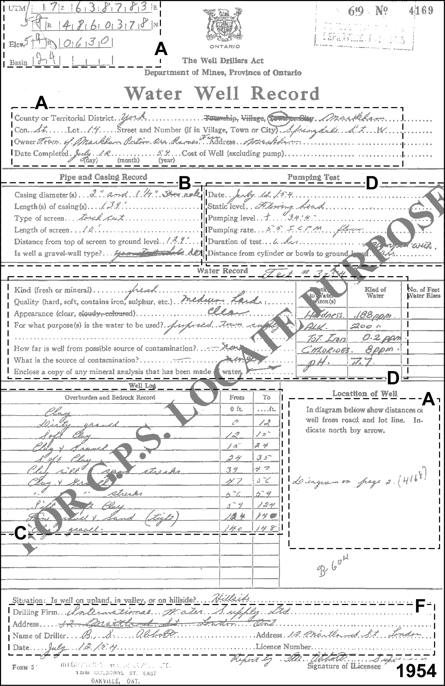
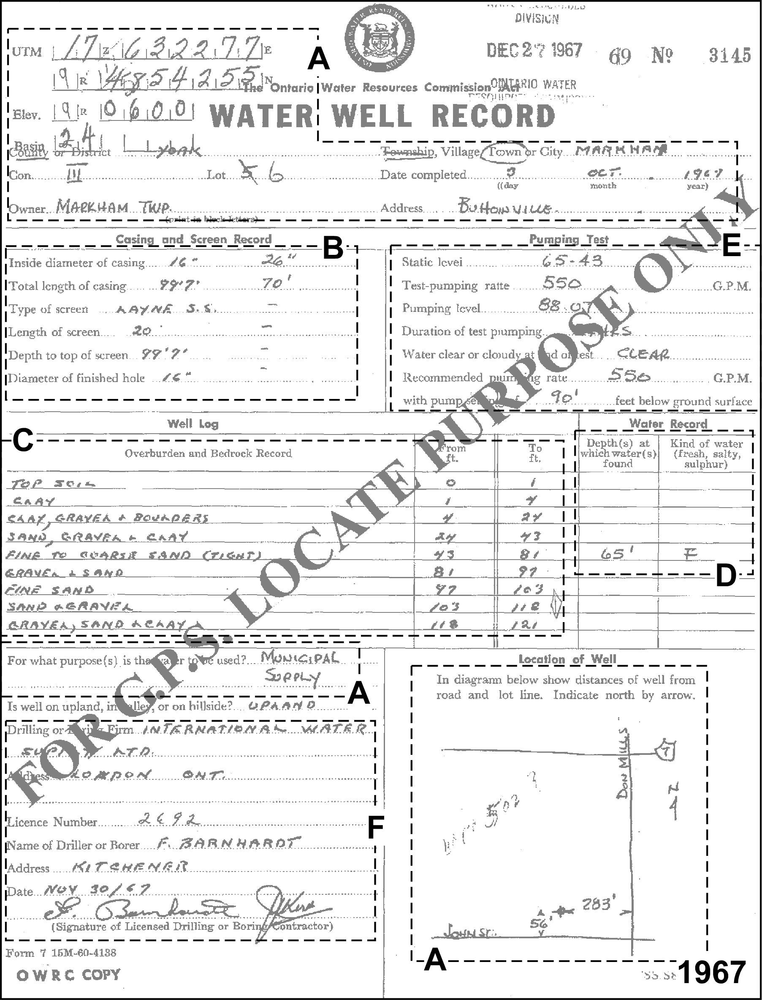
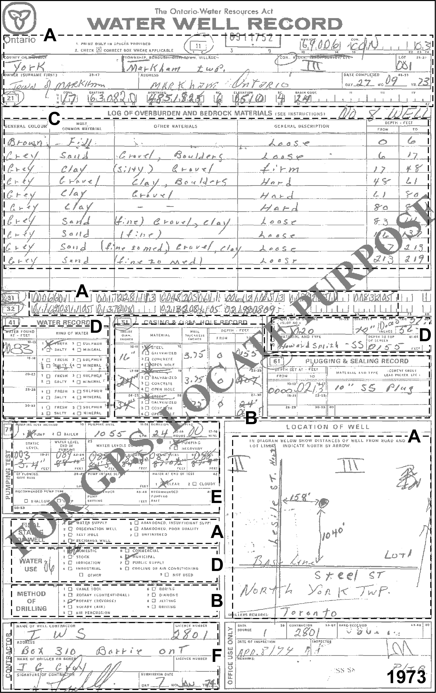
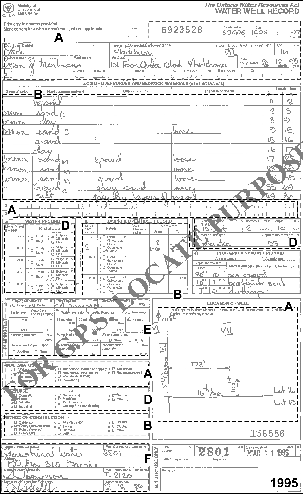

## Section 2.3.1 MOE Records

Over the years, there have been a number of slightly different MOE borehole
report forms that are submitted by well drillers - four are provide here (from
the years: 1954, 1967, 1973 and 1995).  Information on the forms remains
mostly consistent and has been grouped into the following sections:

* **A** - Location Information
* **B** - Borehole Information
* **C** - Geologic Information
* **D** - Water Levels and Water Description
* **E** - Pumping Information
* **F** - Driller Details

Note that the information recorded in the database (and described below) is
not shown on these sheets but is rather assembled, for example, by:  the type
of location we're describing (a borehole/well); the reassignment of purposes
to a ORMGP code versus the original MOE code; where the quality-of-positioning
codes can be found within the database; etc...  Additional notes have been
provided in many of these cases to avoid the confusion that these values/codes
have been issued by the MOE. 

Affected tables are listed within each alphabetic section along with their
related reference tables and fields.  A short description and/or the reference
table (along with the record which is being used, both text description and
[coded value]) is provided with each field used.  The borehole report from
1973 is being used as a reference.

#### A - Location Information

##### D_LOC

* LOC_NAME - 6911752 
    + This is the MOE Record Number (also referred to as WELL_ID)
* LOC_NAME_ALT1 - Town of Markham
    + This is the owner name
* LOC_TYPE_CODE - 1
    + R_LOC_TYPE_CODE - *Well or Borehole [1]*
    + This coding is not from the MOE but has been added to differentiate
    wells and boreholes from other location types (e.g. climate stations,
    documents, etc...)
* STATUS_CODE - 1
    + R_LOC_STATUS_CODE - *Active [1]*
    + Note that the MOE does not use this status code; a wells status is a
    cross between its use (e.g. Water Supply, Recharge Well, etc...) and
    status (e.g. Abandoned - Quality, Abandoned - Supply, etc...)

##### D_LOC_ADDRESS

* LOT - 001
* CON - 3
* COUNTY_CODE - 69
    + R_COUNTY_CODE - *YORK [69]*
* TOWNSHIP_CODE - 69006
    + R_TOWNSHIP_CODE - *MARKHAM TOWN [69006]*

The D_LOC_ADDRESS table links to the D_LOC table through the LOC_ID field.

##### D_LOC_PURPOSE_HIST

* PURPOSE_PRI_CODE - 10
    + R_PURPOSE_PRI_CODE - *Water Supply [10]*
    + This particular code is not taken from the MOE but is now an
    amalgamation of several sources of purposes; refer to **Section 2.1**
    (D_LOC_PURPOSE) for further details
* PURPOSE_SEC_CODE - 22
    + R_PURPOSE_SEC_CODE - *Municipal Supply [22]*

The D_LOC_PURPOSE_HIST table links to the D_LOC table through the LOC_ID field.

##### D_LOC_SPATIAL_HIST

* X - 630839
* Y - 4852197
* EPSG_CODE - 26917
    + This is the European Petroleum Survey Group projection coding scheme
    (and is a standard used by many GIS programs); for the ORMGP, the 
    projection used is UTM, Zone 17N, NAD83; these are values converted from
    the X_OUOM and Y_OUOM fields (the latter records the coordinates from the
    reporting form)
* X_OUOM - 630820
* Y_OUOM - 4851825
* EPSG_CODE_OUOM - 26717
    + This corresponds to UTM, Zone 17N, NAD27; ; note that until the early
    1990's, well coordinates were typically reported in NAD27
* QA_COORD_CODE - 4
    + R_QA_COORD_CODE - *Margin of Error : 30 m - 100 m [4]*
* ELEV - 155.448
    + This is the value converted from the ELEV_OUOM field
* ELEV_UNIT_CODE - 6
    + R_UNIT_CODE - *masl [6]*
* ELEV_OUOM - 510
    + This is the original elevation (i.e. not tied to a DEM)
* ELEV_UNIT_OUOM - fasl
* QA_ELEV_CODE - 4
    + R_QA_ELEV_CODE - *Read from topographic map, contour interval - 10 Ft
    [4]*

Note that at this time (1973) and right up until about 2008 when the use of
GPS units became increasingly pervasive, the coordinates for a well were very
rarely, if ever, provided by the driller.  Rather, the Ministry employed
students who would use the driller's location map on the well record form to
locate the well on a topographic map, and determine the UTM coordinates (in
NAD27 at the time) and elevation of the well.  Accuracy would be based on the
scale of topographic map.  By default, recent MOE records currently use the
NAD83 geodetic datum.

The D_LOC_SPATIAL_HIST table links to the D_LOC table through the LOC_ID
field.

#### B - Borehole Information

##### D_LOC_BOREHOLE

* BOTD - 66.752
    + This is the converted depth (to mbgs) from BOT_OUOM
* BOT_OUOM - 219
* UNIT_OUOM - fbgs
* DRILL_METHOD_CODE - 3
    + R_DRILL_METHOD_CODE - *Rotary (reverse) [3]*
* DRILL_START_DATE - 1973-09-27

The D_LOC_BOREHOLE table links to D_LOC through the LOC_ID field.

##### D_LOC_BOREHOLE_CONS

* CON_TYPE_CODE - 3
    + R_CON_TYPE_CODE - *Casing - Steel [3]*
* TOPD - 0
* BOTD - 47.244
    + Note that the calculated depths are converted values from the
    TOP_OUOM and BOT_OUOM fields to mbgs
* TOP_OUOM - 0
* BOT_OUOM - 155
* UNIT_OUOM - fbgs
    + This apples to the values in TOP_OUOM and BOT_OUOM
* DIAM - 40.64
    + Note that the diameter is converted from DIAM_OUOM to centimetres
* DIAM_OUOM - 16
* DIAM_UNIT_OUOM - inches
    + This applies to the value in DIAM_OUOM

For any description of the plug, this record has very little information
provided with respect to either the sand pack that is set around the screen or
with respect to the seal or plug.  This is very common for the MOE records;
many wells will not have any of these elements populated in the database.  In
the case of this 1973 well record, it appears that there was some kind of seal
put into the well but the depths cannot be determined.  Certainly with a 20
slot screen set at 155 to 212 feet below ground, there would not be any seal
across this interval.  So the plug information that indicates a 0 to 213 ft
seal is inaccurate.  The same series of data and reference tables would be
used, if the information was available, albeit with modified codes.  Note that
screen information is found at the interval level (i.e. starting with D_INT)
rather than the location level (i.e. starting with D_LOC).

The D_LOC_BOREHOLE_CONS is linked to D_LOC through the LOC_ID field.

#### C - Geologic Information

The primary table and fields for dealing with geologic information, and the
look-up tables referenced, include:

##### D_LOC_GEOL_LAYER

Within this table, there will be one record for each geologic layer in the
original MOE report.  The following example uses the information from the
fourth stratigraphic layer.

* TOPD - 14.6304
* BOTD - 18.5928
    + Note the depth fields are calculated based upon the TOP_OUOM and
    BOT_OUOM fields converted to mbgs
* TOP_OUOM - 48
* BOT_OUOM - 61
* UNIT_OUOM - fbgs
* MATC_CODE - 2
    + R_GEOL_MATC_CODE - *GREY [2]*
* MAT1_CODE - 11
    + R_GEOL_MAT_CODE - *Gravel [11]*
* MAT2_CODE - 5
    + R_GEOL_MAT_CODE - *Clay [5]*
* MAT3_CODE - 13
    + R_GEOL_MAT_CODE - *Boulders [13]*
* MAT4_CODE - 73
    + R_GEOL_MAT_CODE - *Hard [73]*

The D_LOC_GEOL_LAYER table is linked to a location (D_LOC) through the LOC_ID
field.

##### D_LOC_ATTR

This table is used in place of the original D_GEOLOGY_FEATURE table from the
previous ORMGP database schema.

* D_GEOLOGY_FEATURE
    + FEATURE_CODE (1; REF, see below) + FEATURE_TOP_OUOM (83) +
    FEATURE_UNIT_OUOM (fbgs; refer to 'A - General Information, above)
* R_FEATURE_CODE
    + FEATURE_CODE (1) + FEATURE_DESCRIPTION (WATER_FOUND - FRESH)

#### D - Water Levels And Water Description

Water levels are tied to intervals in the form of screened intervals.  

##### D_INT

* INT_NAME - 6911752
    + This is the MOE Record Number
* INT_TYPE_CODE - 18
    + R_INT_TYPE_CODE - *Reported Screen [18]*
* INT_START_DATE - 1973-09-27

The D_INT table links to D_LOC through the LOC_ID field.

##### D_INT_ATTR

The D_INT_ATTR table replaces the use of D_INTERVAL_MONITOR from the previous
versions of the ORMGP database.

* ATTR_CODE - 40
    + R_ATTR_CODE - *Interval - Screen or Soil Depths [40]*
* TOPD - 47.244
* BOTD - 64.6176
    + The depth fields are converted from TOP_OUOM and BOT_OUOM converted to
    mbgs
* TOP_OUOM - 155
* BOT_OUOM - 212
* UNIT_OUOM - fbgs
    + This applies to TOP_OUOM and BOT_OUOM

The D_INT_ATT table is linked to D_INT through the INT_ID field.  Additional
attributes associated with the screen would be found in the D_INT_ATTR_RD
table, namely the screen slot and the screen diameter.

##### D_INT_ATTR_RD

The screen slot would be captured by:

* RD_NAME_CODE - 71434
    + R_RD_NAME_CODE - *Screen Details - Slot Size [71434]* 
* RD_VALUE - 20
* RD_NAME_OUOM - Screen Details - Slot Size
* RD_VALUE_OUOM - 20

Note thatno units are specified for this value.

The screen diameter would be captured (in a separate record) by:

* RD_NAME_CODE - 71435
    + R_RD_NAME_CODE - *Screen Details - Diameter [71435]* 
* RD_VALUE - 25.4
* UNIT_CODE - 35
    + R_UNIT_CODE - *cm [35]*
    + This applies to the RD_VALUE value
* RD_NAME_OUOM - Screen Details - Diameter
* RD_VALUE_OUOM - 10
* RD_UNIT_OUOM - inch
    + This applies to the value in RD_VALUE_OUOM

The D_INT_ATTR_RD table is linked to D_INT_ATTR through the
IATTR_ID field.

##### D_INT_TEMPORAL_2

This is the measured static water level.  Additional water levels are measured
during pumping.

* RD_TPE_CODE - 0
    + R_RD_TYPE_CODE - *WL - MOE Well Record - Static [0]*
* RD_DATE - 1973-09-27
* RD_NAME_CODE - 628
    + R_RD_NAME_CODE - *Water Level - Manual - Static [628]* 
* RD_VALUE - 25.2984
* UNIT_CODE - 18
    + R_UNIT_CODE - *mbgs [18]*
    + This applies to the RD_VALUE value
* RD_NAME_OUOM - Water Level - Manual - Static
* RD_VALUE_OUOM - 83
* RD_UNIT_OUOM - fbgs
    + This applies to RD_VALUE_OUOM

The D_INT_TEMPORAL_2 field is linked to D_INT through the INT_ID field.

#### E - Pumping Information

The information concerning the pumping test are found in D_INT_PUMPTEST and
D_INT_PUMPTEST_STEP.  The water levels associated with the pumping test are
found in D_INT_TEMPORAL_2.

##### D_INT_PUMPTEST

* PT_DATE - 1973-09-27
* PT_NAME - 6911752
    + This is the MOE Record Number
* REC_PUMP_RATE_IGPM - 1055

The D_INT_PUMPTEST table is linked to D_INT through the INT_ID field.

##### D_INT_PUMPTEST_STEP

* PUMP_RATE - 1055
    + This is converted from PUMP_RATE_OUOM
* UNIT_CODE - 104
    + R_UNIT_CODE - *igpm [104]*
* PUMP_RATE_OUOM - 1055
* PUMP_RATE_UNITS_OUOM - gpm
    + The record rate on the MOE report is stated as gpm; this is assumed to
    be igpm and applies to PUMP_RATE_OUOM
* PUMP_START - 1973-09-27 00:00
* PUMP_END - 1973-09-28 00:00
    + This was a twenty-four hour pump test

The D_INT_PUMPTEST_STEP table is linked to D_INT_PUMPTEST through the PT_ID
field.

##### D_INT_TEMPORAL_2

The water levels measured during the pumping test appear, in general, at
fifteen minute intervals (other intervals are possible, though).  In addition,
there can be a water level measured at the completion of the pumping test (at
the twenty-four hour mark).  In this case, then, five pumping water levels
would be recorded.  Here is shown the levels measured at the thirty minute
mark.  Note that the starting time is generally unknown.  As such, a midnight
starting hour is imposed.

* RD_TYPE_CODE - 65
    + R_RD_TYPE_CODE - *WL - MOE Well Record - Pumping [65]*
* RD_DATE - 1973-09-27 00:30
* RD_NAME_CODE - 70899
    + R_RD_NAME_CODE - *Water Level - Manual - Other [70899]*
* RD_VALUE - 25.908
* UNIT_CODE - 18
    + R_UNIT_CODE - *mbgs [18]*
    + This applies to the RD_VALUE field
* RD_NAME_OUOM - Water Level - Manual - Other
* RD_VALUE_OUOM - 85
* RD_UNIT_OUOM - fbgs
    + This applies to the RD_VALUE_OUOM field

*Figure 2.3.1.1 Example MOE Water Well Record - 1954*

*Figure 2.3.1.2 Example MOE Water Well Record - 1967*

*Figure 2.3.1.3 Example MOE Water Well Record - 1973*

*Figure 2.3.1.4 Example MOE Water Well Record - 1995*

*Last Modified: 2025-09-10*
