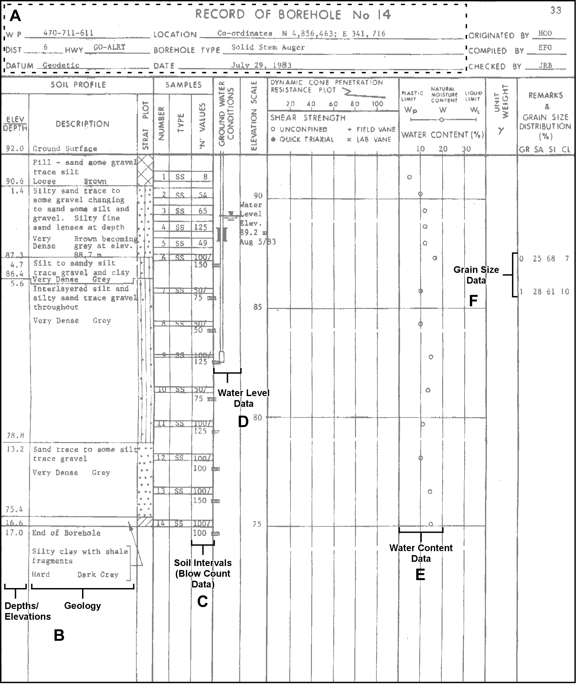

## Section 2.3.2 Consultant Borehole Records

From a standard borehole reporting sheet, a number of tables are affected when
recording and transcribing information into the database.  These have been
grouped into the following sections:

* **A** - General Information (location and borehole)
* **B** - Geologic Information
* **C** - Soil Intervals (blow count data)
* **D** - Water Levels
* **E** - Water Content (laboratory analysis)
* **F** - Grain Size (laboratory analysis)

Note that the example borehole sheet has been pulled from a geotechnical foundation report.

*Figure 2.3.2.1 Borehole Record - example with sections indicated*

#### A - General Information

##### D_LOC

* LOC_NAME - GO-ALRT - 6
* LOC_NAME_ALT1 - 470-711-611
    + Note that the various name fields found in the data tables are
    searchable using a single query; adding project and associated information
    in these fields allows a particular borehole to be readily found
* LOC_TYPE_CODE - 1
    + R_LOC_TYPE_CODE - *Well or Borehole [1]*
* STATUS_CODE - 1
    + R_LOC_STATUS_CODE - *Active [1]*

##### D_LOC_BOREHOLE

* BOTD - 17
* BOT_OUOM - 17
* UNIT_OUOM - mbgs
* DRILL_METHOD_CODE - 13
    + R_DRILL_METHOD_CODE - *Hollow Stem Auger [13]*
* LOGGED_BY - EFO
* CHECKED_BY - JRB
* DRILL_START_DATE - 1983-07-29

##### D_LOC_PURPOSE_HIST

* PURPOSE_PRI_CODE - 3
    + R_PURPOSE_PRI_CODE - *Engineering [3]*
* PURPOSE_SEC_CODE - 47
    + R_PURPOSE_SEC_CODE - *Geotech Testhole [47]*

##### D_LOC_SPATIAL_HIST

* X - 657490.5
* Y - 4857028
* EPSG_CODE - 26917
    + Refer to **Section 2.3.1** for details concerning the assignment of the
    EPSG_CODE
* X_OUOM - 341716
* Y_OUOM - 4856463
* EPSG_CODE_OUOM - 7991
    + This corresponds to MTM Zone 10 and is tied to the NAD27 datum (as this 
    was drilled in 1983, it is likely that partiuclar datum was being used)
* QA_COORD_CODE - 3
    + R_QA_COORD_CODE - *Margin of Error : 10 - 30 m [3]*
    + This is estimated for this location
* ELEV_CODE - 2
    + R_QA_ELEV_CODE - *Original [2]*
* ELEV - 92.0
    + This is the value copied from the ELEV_OUOM field
* ELEV_UNIT_CODE - 6
    + R_UNIT_CODE - *masl [6]*
* ELEV_OUOM - 92.0
    + This is the original elevation
* ELEV_UNIT_OUOM - masl
* QA_ELEV_CODE - 9
    + R_QA_ELEV_CODE - *Unknown Elevation [9]*
    + There are no details concerning the source of the elevation so no
    accuracy can be assigned; note that a DEM elevation will subsequently be
    assigned as this is not a surveyed elevation (i.e. a new record will be
    added to the D_LOC_SPATIAL_HIST to capture the updated DEM elevation);
    refer to **Section 2.4.2** for details

These tables are related through LOC_ID, a whole number assigned to each
location within the ORMGP database.  Note that if this borehole record was
pulled from a report within the ORMGP Report Library (refer to **Section
2.3.7** and **2.6** for additional details), the D_LOC_RELATED table would be
used to create an association between the document (which would have its own
LOC_ID) and this borehole.

#### B - Geologic Information

##### D_LOC_GEOL_LAYER

Within this table, there will be one data record for each geologic layer
specified on the borehole record.  The following example uses the information
from the third stratigraphic layer (out of six layers total).  The geologic
materials are converted from text descriptions to geologic codes (as found in
the R_GEOL_MAT_CODE table).

* TOPD - 4.7
* BOTD - 5.6
* TOP_OUOM - 4.7
* BOT_OUOM - 5.6
* UNIT_OUOM - mbgs
* MATC_CODE - 2
    + R_GEOL_MATC_CODE - *GREY [2]*
* MAT1_CODE - 6
    + R_GEOL_MAT_CODE - *Silt [6]*
* MAT2_CODE - 28
    + R_GEOL_MAT_CODE - *Sand [28]*
* MAT3_CODE - 11
    + R_GEOL_MAT_CODE - *Gravel [11]*
* MAT4_CODE - 5
    + R_GEOL_MAT_CODE - *Clay [5]*
* MATD_CODE - 66
    + R_GEOL_MAT_CODE - *Dense [66]*
    + This particular field provides information on the layers consistency
* GEOL_DESC - Grey silt to sandy silt, trace gravel and clay, very dense
    + Note that the complete geologic description, if available, should be
    included within this field as an aid to interpretation

The D_LOC_GEOL_LAYER table is linked to a location (D_LOC) through the LOC_ID
field.  Note that in addition, though not used as part of this example,
details such as *Brown, becoming grey at 88.7m* could be captured in the
D_LOC_ATTR table.

#### C - Soil Intervals (Blow Count Data)

This type of information is actually related to a (field-collected) soil sample with a specific top and bottom.  In some cases (two here) these samples are further analyzed in a laboratory for additional parameters that would be stored elsewhere (for example, grain size; see 'F - Lab Analysis' and Section 2.3.3).  The primary table and fields for dealing with the soil sample and blow count values, as well as their associated look-up/reference tables include:

* D_INTERVAL
    + INT_NAME
    + INT_NAME_ALT1
    + INT_TYPE_CODE (118; REF, see below)
    + INT_START_DATE (1983-07-29)
* D_INTERVAL_SOIL
    + SOIL_TOP_OUOM
    + SOIL_BOT_OUOM
    + SOIL_UNIT_OUOM (mbgs; see below)
    + SOIL_BLOW_COUNT (per 6" of penetration)
* R_INT_TYPE_CODE
    + INT_TYPE_CODE (118)
    + INT_TYPE_DESCRIPTION (Soil)
* R_UNIT_CODE
    + UNIT_DESCRIPTION (mbgs; refer to 'A - General Information', above)

The D_INTERVAL table contains two keys - a LOC_ID and an INT_ID (this is also an randomly assigned integer serving as a primary key).  All subsequent interval tables are related based upon this INT_ID (as found in, for this example, D_INTERVAL_SOIL).

#### D - Water Levels

Water levels are also tied to intervals, as was the case with the 'Soil Intervals' discussed above, but, they are associated with 'screen' intervals.  The primary table and fields for dealing with water levels, as well as the look-up tables referenced, include:

* D_INTERVAL
    + INT_NAME
    + INT_NAME_ALT1
    + INT_TYPE_CODE (27; REF, see below)
    + INT_START_DATE (1983-08-05)
* D_INTERVAL_MONITOR
    + MON_TOP_OUOM (0)
    + MON_BOT_OUOM (10)
    + MON_UNIT_OUOM (mbgs; see below)
* D_INTERVAL_TEMPORAL_2
    + RD_DATE (1983-08-05)
    + RD_NAME_CODE (628)
    + RD_NAME_OUOM (Water Level - Manual - Static)
    + RD_VALUE_OUOM (2.8)
    + RD_UNIT_OUOM (mbgs; see below)
* R_INT_TYPE_CODE
    + INT_TYPE_CODE (18)
    + INT_TYPE_DESCRIPTION (Reported Screen)
* R_RD_NAME_CODE
    + RD_NAME_CODE (628)
    + RD_NAME_DESCRIPTION (Water Level - Manual - Static)
* R_RD_TYPE_CODE
    + RD_TYPE_CODE (74)
    + RD_TYPE_DESCRIPTION (Static)
* R_UNIT_CODE (Interval and Water Level)
    + UNIT_DESCRIPTION (mbgs; refer to 'A - General Information', above)

Any information measured in the field is to be stored in the D_INTERVAL_TEMPORAL_2 table.  In this case, if more water levels were taken at this location, such information would be added to the temporal table tied back to the same interval as tracked by the INT_ID.

#### E - Laboratory Analysis - Water Content

Information or data produced or determined in a laboratory is stored in the D_INTERVAL_TEMPORAL_1A/1B tables.  As was the case for blow counts and water levels, the Water Content information is also tied back to an interval, in this case a "Soil" Interval (described in 'C - Soil Intervals', above).  The primary table and fields for dealing with sample water content (not including the interval, as previously described), as well as the look-up tables referenced, include:

* D_INTERVAL_TEMPORAL_1A
    + SAM_SAMPLE_NAME
    + SAM_SAMPLE_NAME_OUOM
    + SAM_SAMPLE_DATE (1983-07-29)
    + SAM_SAMPLE_DATE_OUOM (1983-07-29)
    + SAM_TYPE_CODE (12)
* D_INTERVAL_TEMPORAL_1B
    + RD_NAME_CODE (289)
    + RD_NAME_OUOM (Moisture Content)
    + RD_VALUE_OUOM
    + RD_UNIT_OUOM (%)
* R_RD_NAME_CODE
    + RD_NAME_CODE (289)
    + RD_NAME_DESCRIPTION (Moisture Content)
* R_SAM_TYPE_CODE
    + SAM_TYPE_CODE (12)
    + SAM_TYPE_DESCRIPTION (Regular Sample)
* R_UNIT_CODE
    + UNIT_DESCRIPTION (%)

The INT_ID for the particular reading ties the D_INTERVAL and D_INTERVAL_TEMPORAL_1A tables together.  At this point, though, a new identifier (SAM_ID) relates the two temporal tables (1A & 1B).  In this way a particular sample (stored in 1A) can have a number of parameters (stored in 1B).  Note that each of the different soil samples would have a water content value associated with it.

#### F - Laboratory Analysis - Grain Size

Again, as this information is a laboratory determined measurement, it is also held in the D_INTERVAL_TEMPORAL_1A/1B tables.  This information is also tied back to an interval, in this case a 'soil' interval (described in 'C - Soil Intervals', above).  Refer also to Section 2.3.3.  The primary table and fields for dealing with sample grain size distribution (not including the interval, as previously described), as well as the look-up tables referenced, include:

* D_INTERVAL_TEMPORAL_1A
    + SAM_SAMPLE_NAME
    + SAM_SAMPLE_NAME_OUOM
    + SAM_SAMPLE_DATE (1983-07-29)
    + SAM_SAMPLE_DATE_OUOM (1983-07-29)
    + SAM_TYPE_CODE (12)
* D_INTERVAL_TEMPORAL_1B
    + RD_NAME_CODE (each of 70756, 70757,70758,70759)
    + RD_NAME_OUOM (each of %Clay, %Silt, %Sand, %Gravel)
    + RD_VALUE_OUOM (each of 7, 68, 25, 0 for the first sample)
    + RD_UNIT_OUOM (%)
* R_RD_NAME_CODE
    + RD_NAME_CODE (each of 70756, 70757,70758,70759)
    + RD_NAME_DESCRIPTION (each of %Clay, %Silt, %Sand, %Gravel)
* R_SAM_TYPE_CODE
    + SAM_TYPE_CODE (12)
    + SAM_TYPE_DESCRIPTION (Regular Sample)
* R_UNIT_CODE
    + UNIT_DESCRIPTION (%)

The grain size analysis only applies to the sixth and seventh soil sample.  Within the D_INTERVAL_TEMPORAL_1B table, each sample would have four rows associated with it based on the clay, silt, sand and gravel breakdown (eight rows in total).  These would be converted (in this case, through a straight copy procedure, from the OUOM fields to the actual 'value' fields during a SiteFX conversion of 'new' information).  Also note that if the moisture content and the grain size analysis were undertaken on the same sample at the same laboratory, then they could possibly share a sample identifier (i.e. SAM_ID) in the D_INTERVAL_TEMPORAL_1A table.  Since no lab sheets were provided in this report, the data would be split into two different samples.

*Last Modified: 2025-05-30*
