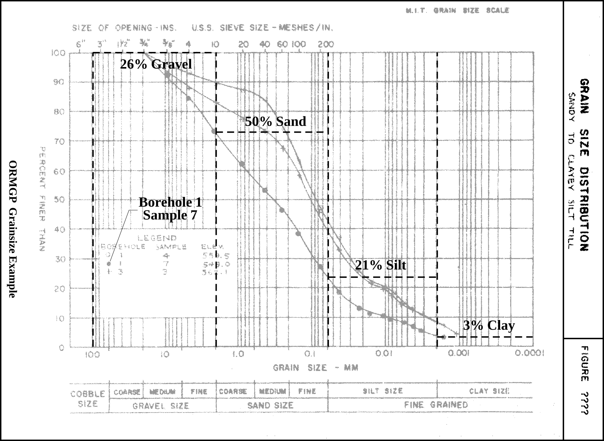
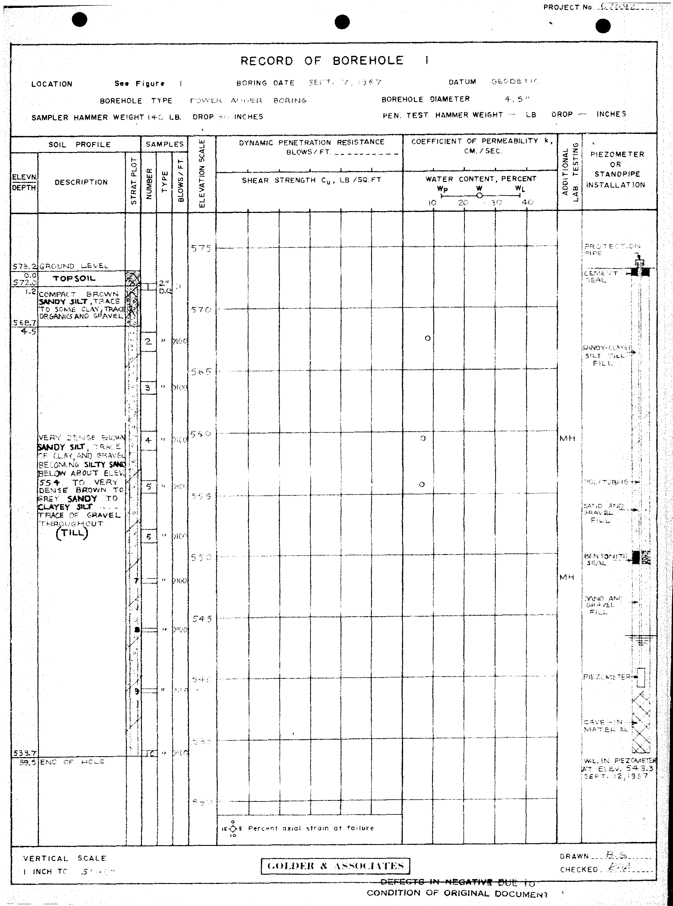

## Section 2.3.3 Grain Size Data

When grain size data is available, it may be indicated as part of the borehole
log (refer to **Section 2.3.2** for details) or as a separate analysis.  An
example of the latter is found here.  

*Figure 2.3.3.1 Grain Size Analysis - source data*

The results of three sample analyses are shown.  If the values related
to *Borehole 1, Sample 7* are examined (which has a number of data points), we
can see that the components can be broken down into:

* 3% Clay
* 21% Silt
* 50% Sand
* 26% Gravel

This analysis is found in a report held within the ORMGP Report Library
(document folder *6354*) from which the particular borehole (i.e. *Borehole
1*) has been entered into the database (using LOC_NAME *MTO-30M14-066/1*).

*Figure 2.3.3.2 Borehole 1 Record*

This borehole location has the distinct LOC_ID of *341102* (note that this
is a *Version 8* database location identifier; the *Version 7* identifier is
*1125539377*) but no soil samples are currently identified; a screened
interval, for water levels, does exist.  

#### A New Interval

As there is currently no soil interval entered into the database, a new one
needs to be created.  The affected tables would be:

##### D_INT

* LOC_ID - 341102
    + This location was already present in the ORMGP database
* INT_ID - 363068
    + As this is a new record for the D_INT table, an identifier is
    automatically generated; in *Version 8* of the ORMGP database, INT_ID is
    an identify field - a counter that increments when a record is added 
* INT_NAME - MTO-30M14-66-1 Soil-549
    + The name of the location (and interval) is included here along with a
    means by which the particular sample can be identified;  in this case, it
    is the original elevation of the sample-top as identified up the borehole
    record
* INT_NAME_ALT1 - Sample 7
    + Adding the sample number allows any user, reviewing the source report,
    to determine the original data associated with the interval
* INT_TYPE_CODE - 29
    + R_INT_TYPE_CODE - *Soil or Rock [29]*
* INT_START_DATE - 1967-09-07
    + As no sample analysis date is provided, the date of the borehole
    construction (from the report) is used instead

This table would be linked to D_LOC through the LOC_ID field.

##### D_INT_ATTR

This table replaces the use of D_INTERVAL_MONITOR from previous versions of
the ORMGP database.

* INT_ID - 363068
    + This is copied from the D_INT table
* ATTR_CODE - 40
    + R_ATTR_CODE - *Interval - Screen or Soil Depths [40]*
* TOPD - 7.37616
* BOTD - 7.52856
    + Note that these are calculated from the TOP_OUOM and BOT_OUOM fields
* TOP_OUOM - 24.2
* BOT_OUOM - 24.7
    + These values, extracted from the original borehole record, have units
    specified through UNIT_OUOM; note that the values have been converted from
    elevations (as presented on the borehole record) to depths using the
    ground elevation listed on the borehole record
* UNIT_OUOM - fbgs

This table is linked to D_INT through the INT_ID field.

#### Grain Size Data

Grain size data can be found in either the temporal or attribute tables tied
to a particular interval.  The former is generally used when there is
information available concerning the laboratory and the type of analysis that
was carried out.  The temporal tables should be used if multiple sets of
records (over time) are to be linked to an interval.  If information
concerning the laboratory is absent or there will likely only be a single
record associated with the interval, the attribute tables can be used.  Both
examples are presented.

##### D_INT_ATTR_RD

Four grain size percentages are available, as listed above.  This would result
in four records to be tied (through IATTR_ID and the D_INT_ATTR table) to the
soil interval specified in D_INT.  The example shown here is only for gravel.

* RD_NAME_CODE - 70759
    + R_RD_NAME_CODE - *%Gravel [70759]*
* RD_VALUE - 26
* UNIT_CODE - 1
    + R_UNIT_CODE = *% [1]*
* RD_NAME_OUOM - %Gravel
* RD_VALUE_OUOM - 26
* RD_UNIT_OUOM - %

The D_INT_ATTR_RD table is linked to D_INT_ATTR through IATTR_ID.

Alternatively, if the temporal tables are being used, some of the populated
fields would be made-up of pseudo-values (i.e. they would be functioning as
placeholds).  A prime example is the SAM_NAME - this field cannot be empty in
the D_INT_TEMPORAL_1A table.  The setup would then be:

##### D_INT_TEMPORAL_1A

* INT_ID - 363068
* SAM_ID
    + This field is the primary key of the D_INT_TEMPORAL_1A table; the value
    here is automatically generated when a record is added
* SAM_NAME - MTO-30M14-66-1 Soil-549
    + We are assigning the interval name to the sample name as a placeholder
* SAM_DATE - 1967-09-07
    + This matches the starting interval date
* SAM_TYPE_CODE
    + R_SAMP_TYPE_CODE - *Regular Sample [12]*

The D_INT_TEMPORAL_1A table is linked to D_INT through INT_ID.

There are additional fields within this table that can be used to track
information regarding the laboratory that performed the analyses.  This could
include the laboratory sampling number (LAB_SAMPLE_ID), its internal job
number (LAB_JOB_NUMBER) and analysis date (LAB_ANALYSIS_DATE).  This would
allow the user to (hopefully) revisit the original report or contact the
laboratory itself to check the data entry in case of a possible error (should
a problem with the data be discovered in the future).

However, none of this information is available for this analysis.

##### D_INT_TEMPORAL_1B

There would be four records in this case.  We will only use the gravel value
for the example.

* RD_NAME_CODE - 70759
    + R_RD_NAME_CODE - *%Gravel [70759]*
* RD_VALUE - 26
* UNIT_CODE - 1
    * R_UNIT_CODE - *% [1]*
* RD_NAME_OUOM - %Gravel
* RD_VALUE_OUOM - 26
* RD_UNIT_OUOM - %

The SAM_ID field links D_INT_TEMPORAL_1B and D_INT_TEMPORAL_1A.

*Last Modified: 2026-09-10*
