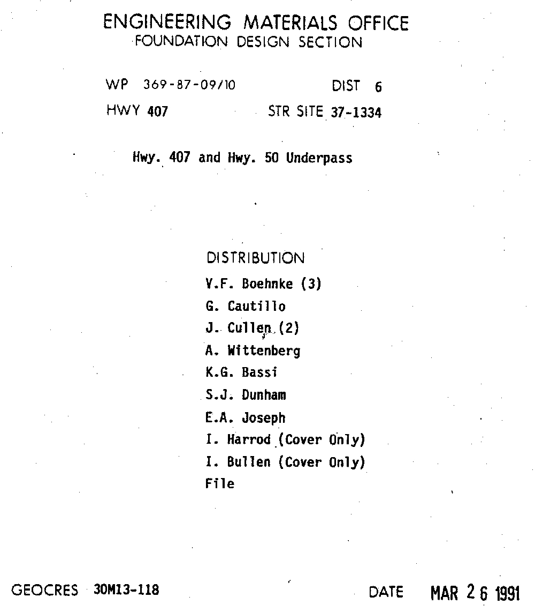
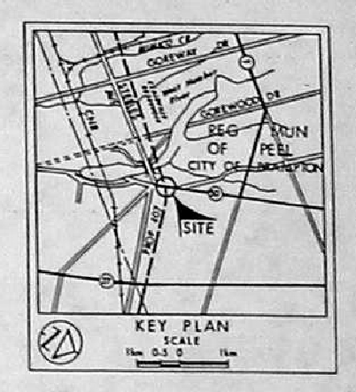
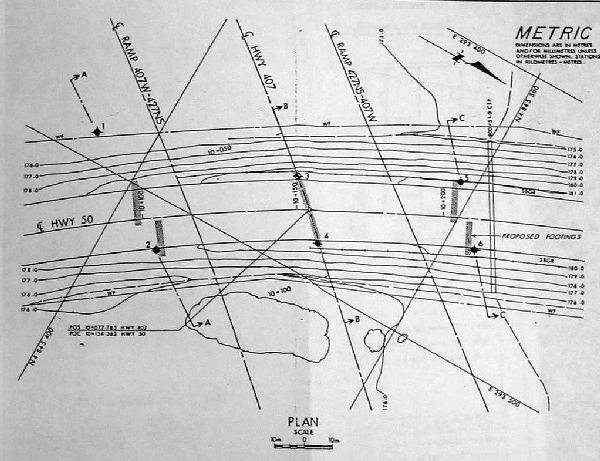
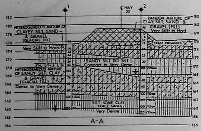
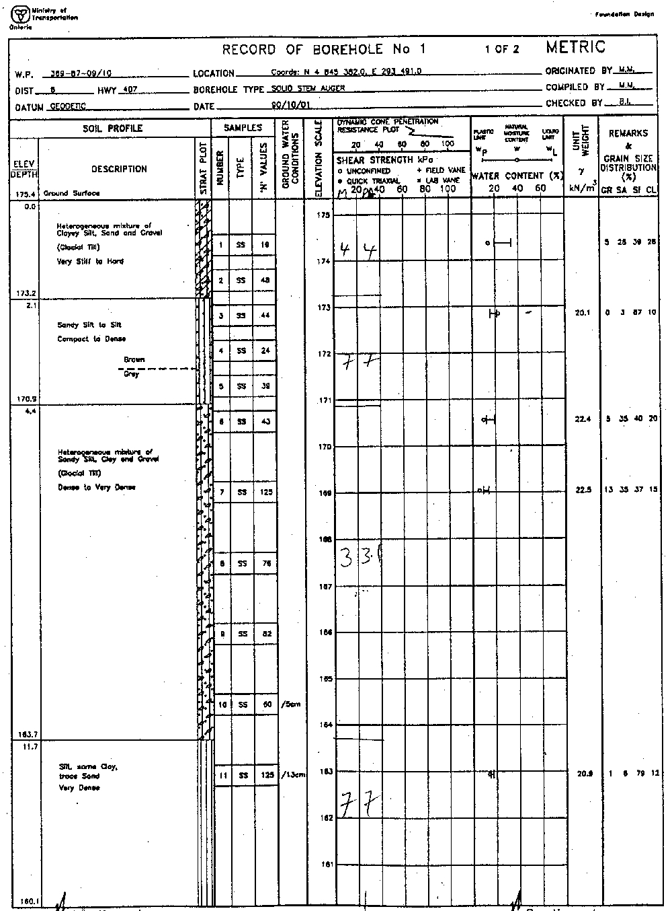
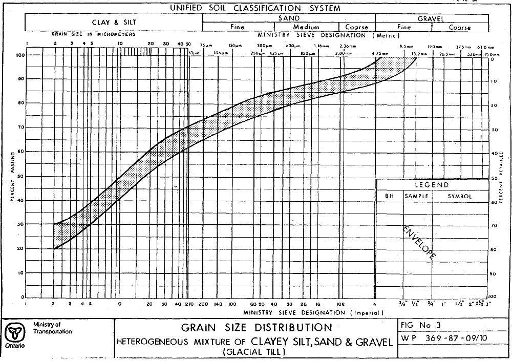

## Section 2.3.7 Report Library (Documents) 

Documents in the ORMGP are treated and accessed similarly to any other
location type.  The D_LOC_DOCUMENT, in addition to D_LOC, carries information
that is particular to this type of entity.  Contrary to previous versions of
the database, the current version (i.e. Version 8) does not carry a second
automatically assigned key (DOC_ID) along with the primary key (LOC_ID).
However, the document folder identifier (i.e. DFID) which is used as
the directory name in which the document is to be stored (within the ORMGP
Report Library) will differ for each of these locations (and, as such, could
be considered a second key to this table).  Refer to **Section 2.6** for
details concerning the ORMGP Report Library and its structure.

Here we'll use a document from the library ('30M13-118 Highway 407
and Highway 50 Underpass', DFID *154*) as an example of the information that
can be extracted from the report and included within the database.  Note that
in most cases, this information would be found across multiple pages within
the actual report.

*Figure 2.3.7.1 Example document - cover page*

If this was a new location, a new folder identifier would be assigned from
within the range available to the particular user (or group).  Each identifier
would be unique and the ranges allow multiple groups to independently add
documents into the Report Library.

The following tables and fields would be populated.

##### D_LOC

* LOC_NAME - 154
    + This, by default, matches the Report Library directory number
* LOC_NAME_ALT1 - 30M13-118 Highway 407 and Highway 50 Underpass)
    + This would be the actual title of the report
* LOC_TYPE_CODE - 25
    + R_LOC_TYPE_CODE - *Document [25]*

##### D_LOC_SPATIAL_HIST

In this case, there is an intersection name provided (i.e. Hwy 407 and Hwy 50
underpass) along with a scanned location map.  

*Figure 2.3.7.2 Example document - study area*

From these, the coordinates of the location can be determined.

* X - 609424
* Y - 4845361
* EPSG_CODE - 26917
    + Refer to **Section 2.3.1** for details concerning the assignment of the
    EPSG_CODE
* QA_COORD_CODE - 5
    + R_QA_COORD_CODE - *Margin of Error : 100 m - 300 m [5]*
    + Note that the **X** and **Y** coordinates are approximate, only, and are
    generally associated with the center point of the area to which the report
    is ascribed; a value of *5* is usually assigned for documents as it is
    associated with the largest error commonly used by analyses within the
    ORMGP database (i.e. a QA_COORD_CODE larger that *5* is considered to have
    too large of an error for most types of analysis)

Elevations are not usually assigned to document locations.  The
D_LOC_SPATIAL_HIST table is related to the D_LOC table through the LOC_ID
field.

##### D_LOC_DOCUMENT

* DOC_YEAR - 1991
* DFID - 154
    + Refer to **Section 2.6** for details
* DOC_AUTHOR - Ministry Of Transportation
    + Note that this is a GEOCRES document
* DOC_AUTHOR_AGENCY_CODE - 68
    + R_DOC_AUTHOR_AGENCY_CODE - *MTO - Ministry of Transportation [68]*
* DOC_LOCATION_CODE - 1
    + R_DOC_LOCATION_CODE - *Site [1]*
    + This report deals with a vary particular location (i.e. a site); if the
    report applied to a larger area instead (for example, the Oak Ridges
    Moraine), a more a *Regional [3]* code would be used instead
* DOC_DESCRIPTION - 1 report pdf, 1 figure
    + This is a free-form text field allowing a description of the available
    material which makes up the report
* DOC_TOPIC1_CODE - 76
    + R_DOC_TOPIC_CODE - *Geotechnical [76]*
* DOC_CLIENT_AGENCY1_CODE - 1
    + R_DOC_CLIENT_AGENCY_CODE - *MOE - Ministry of the Environment [1]*
* DOC_PAGE_RANGE - 1-25
    + This is a free-form text field which is used to list the number of pages
    (or the page range) for the particular report

##### D_LOC_ATTR - Data

The attribute table is used to capture the variety of information or datasets
available within the report.  (In Version 7, and earlier, of the database this
capability was specified through the use of a variety of *YN* and *YN_ENTERED*
fields within D_DOCUMENT.)  In addition, the same record can be used to record
whether that dataset has been entered in the database.  The types currently
available include the presence of: Borehole Log; Chemistry Data; Cross
Section; Digital Data; etc... Refer to the R_ATTR_CODE table for all available
data tags.  

From this document, multiple records will be added to the D_LOC_ATTR table.
There is, for example, a location map.

* ATTR_CODE - 30
    + R_ATTR_CODE - *Document - Location Map YN [30]*
* VALI - 1
    + A non-null value (defaulting to *1*) indicates the presence of the
    particular information present in the report; if the information has been
    entered into the database (for example, in the case of waterlevels tied to
    a borehole), a value of *1* should be assigned to the VALI2 field

*Figure 2.3.7.3 Example document - location map*

There is a cross-section within the report.

* ATTR_CODE - 25
    + R_ATTR_CODE - *Document - Cross Section YN [25]*
* VALI - 1

*Figure 2.3.7.4 Example document - cross section*

A borehole log is present and it includes a variety of geotechnical data.

* ATTR_CODE - 23
    + R_ATTR_CODE - *Document - Borehole Log YN [23]*
* VALI - 1

* ATTR_CODE - 29
    + R_ATTR_CODE - *Document - Geotechnical Data YN [29]*

*Figure 2.3.7.5 Example document - borehole log*

No records should be used to indicate the absence of a dataset within the
particular report.  Only the information pertinent to the report should be
specified.

In most cases, any report found within the ORMGP Report Library has had an
optical-character-recognition (OCR) analysis applied against it.  This allows
the text within the entire report to be searchable.  However, the capability
is present to record keywords that should be associated within a document (and
this was done for all reports that were first incorporated in the ORMGP Report
Library).  (In Version 7 of the database, and earlier, a variety of KEYWORD\*
fields were available to capture this information.)  This is also incorporated
within the D_LOC_ATTR table.

* ATTR_CODE - 36
    + R_ATTR_CODE - *Document - Keywords [36]*
* VAL_DEF - bridge underpass
    + The default fields (i.e. VAL_DEF and VAL_DEF2) within this table allow
    free-form text to be entered

##### D_INT, D_INT_ATTR and D_INT_ATTR_RD

While under review, it was noted that this report contains grain size analysis
as well as various Atterberg Limit Tests that would be associated with
specific sample intervals (generally split-spoon samples).  As such, soil
sample intervals would be created in D_INT with the variety of parameters
being recorded in the D_INT_ATTR and D_INT_ATTR_RD tables.  The process for
doing so is described in **Section 2.3.3**.

*Figure 2.3.7.6 Example document - grainsize analysis*

*Last Modified: 2025-06-11*
