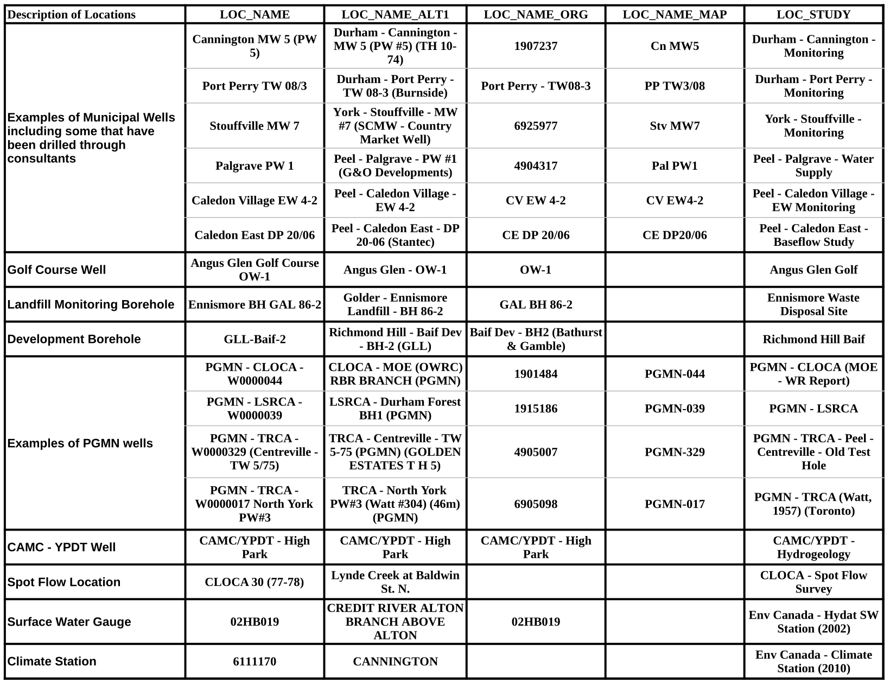

## Section 3.3.1 Naming Conventions

When naming a new location or changing the name of an existing location within
the ORMGP database it is important to consider other users.  Namely, the means
by which they would be able to find this particular location.  The common
naming fields (in D_LOC) of LOC_NAME, LOC_NAME_ALT1, LOC_NAME_ALT2 and
LOC_NAME_ORG are often used for any initial queries against the database.
Another field, LOC_NAME_MAP, is used primarily for spatial display purposes
(where the length of the name is kept as short as possible).  

Additional names can added into the D_LOC_ALIAS table allowing, for example,
any region or conservation area specific names to be captured for any
location.  In addition, the LOC_STUDY field can be used to assist in grouping
and locating wells that may be tied to a particular study (e.g. a development
application).  

In many cases, any intial names assigned are too ambiguous (e.g. *MW 6*)
resulting in hard-to-find or, in some cases, duplication of locations.  These
names where existing in the ORMGP database have been, slowly, updated to
better represent their locations.  All users are encouraged to assist with
implementing a consistent naming structure.  As such, the following should be
considered when naming locations in the database:

* In the D_LOC table, the LOC_NAME_ORG field should contain (as appropriate)
  the MOE WWIS well identifier (note that this is explicitly captured in the
  D_LOC_ALIAS table); alternatively, an historical name can be substituted

* Geographical references should be relatively specific; e.g. *Heart Lake Road
  well* as opposed to *CVC well* or *Grasshopper Road well* versus *CLOCA
  well*

* For new municipal wells it is recommended that users follow the
  strategy of prefixing the well name with the community name in the LOC_NAME
  field (e.g. *King City PW 1*); the LOC_NAME_ALT1 field for municipal wells
  should also contain the Region (e.g. *York - King City - PW 1*); many
  municipal wells also have a local name which can also be added to the name
  (e.g. a LOC_NAME of *Aurora MW 7 (Henderson TW)*; a LOC_NAME_ALT1 of *York -
  Aurora MW 7 - Henderson TW (GLL)*)

For municipal and consultant drilled wells, the following prefixes are
recommended:

* BH (Borehole) - usually any borehole in which a screen is installed for,
  generally, monitoring purposes (i.e. water levels or sampling for water
  quality); unlike Monitoring Wells (MW), listed below, these are usually
  intended for short-term use only (e.g. wells that have been drilled on a
  proposed development site that subsequently are abandoned)

* CS (Climate Station) - added to locations for any climate station that is
  established for short or long term monitoring purposes

* DP (Drive Point) - these are temporary mini-piezometers that are installed
  by hand (i.e. hammered into the ground) into the shallow subsurface often
  in stream beds or wetlands to provide an indication of surfacewater and
  groundwater interactions; normally these are short-lived but can remain in
  place (as active monitoring loctions) for much longer periods; when
  installed in a stream, measurements both inside and outside the pipe can be
  made (refer to *Staff Gauge (G)* below for additional details)

* EW (Early Warning Well ) - also known as a *Sentry Well (SW)*; these are for
  monitoring wells that are specifically used to look at the water quality in
  Wellhead Protection Areas; note that these locations would have a
  LOC_TYPE_CODE of *1* (i.e. *Well or Borehole*) to differentiate it from
  *Surface Water (SW)* locations that would have a LOC_TYPE_CODE of *6*

* MW (Monitoring Well) - current or previously used monitoring wells from
  which water levels or water quality data have been recorded

* PW (Pumping Well) - all those wells that are currently or previously have
  been used for pumping should be designated with a *PW* tag; this would
  include backup pumping wells; in some cases, for example in Durham Region,
  the *MW* prefix is also used (indicating a Municipal Well); an example 
  LOC_NAME would then be *Blackstock MW3 (PW 3)* while the matching
  LOC_NAME_ALT1 would be *Durahm - Blackstock - MW 3 (PW 3)*

* SG (Staff Gauge) - this prefix is used where a staff gauge is placed into a
  water body (e.g. a lake, stream or wetland) to measure the depth of the
  water (commonly with multiple readings over time at the same site); the
  prefix can also apply where a mini-piezometer is installed inside a pipe
  while the water level is being measured on the outside of the pipe; these
  can also be attached to a bridge or other types of infrastructure 

* SW (Surface Water) - this is commonly used as a prefix for both spotflow as
  well as gauged surface water stations

* TW (Test Well) or TH (Test Hole) - an exploration well that was unsuccessful
  and has been abandoned is typically referred to as a test well; at times,
  these exploration wells are not abandoned but are instead left in place as
  a longer term monitoring well; the *TH* prefix is disparaged

It is important to note that the status of municipal or consultant drilled
wells can change over time.  For example, pumping wells can be abandoned or
converted to monitoring wells or vice-versa.  In such cases the prefix (and
name) should be changed with the former name (and earlier prefix designation)
stored in the D_LOC_ALIAS table.  Alternatively, the former prefix can also be
saved in parenthesis at the end of the current name.  Decommissioned pumping
wells should retain the *PW* prefix indefinitely and that name should not be
changed; this change would be noted through modificiation of the
LOC_STATUS_CODE value (refer to R_STATUS_CODE for details).  

Example locations and associated names are listed in Table 3.3.1.1.

*Table 3.3.1.1 D_LOC naming conventions*

*Last Modified: 2025-06-19*
