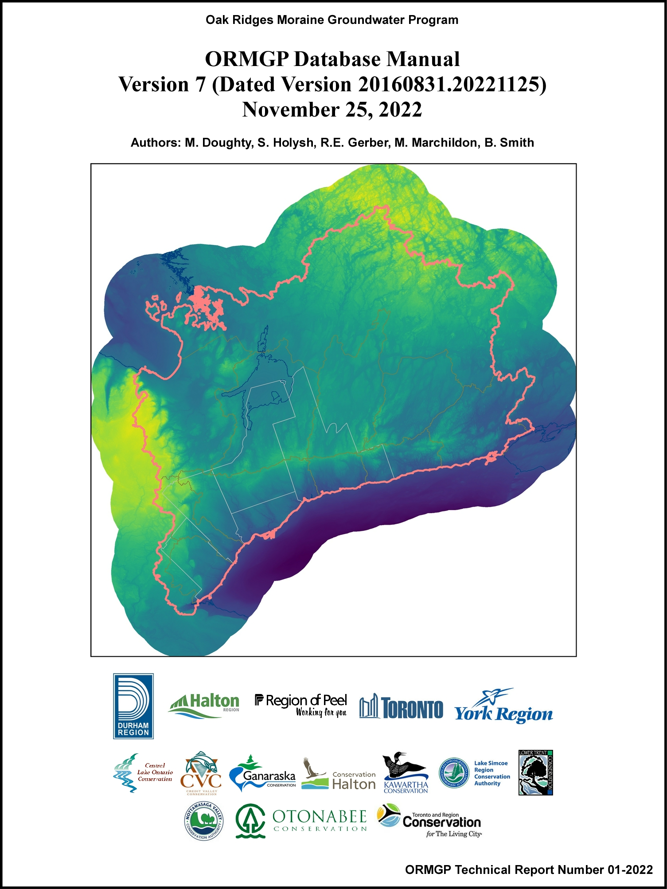

## Table of Contents

#### [Forward](./Forward/forward.html)

### Section 1 - Introduction

* 1.1 Overview
* 1.2 Background
* 1.3 Database Versions

### Section 2 - Understanding the OMGP Database

* 2.1 Tables and Views

* 2.2 General Overview of Relationships

* 2.3 Primary Data Relationships

* 2.4 Secondary (or Derived) Data Relationships)

* 2.5 Locations, Groups and Study Areas

* 2.6 Report Library

* 2.7 Multi-Screen Installations

* 2.8 Multi-Borehole Records

### Section 3 - Practical Applications

* 3.1 Working with the Database

* 3.2 Training Exercises

* 3.3, Guidelines and FAQ

* 3.4 Adding New Data

* 3.5 Changes to Existing Data

### Section 4 - Technical

* 4.1 Detailed Overview of Relationships

* 4.2 Table Details (D_\*, R_\* and Other)

* 4.3 View Details (V_\*)

* 4.4 Database Distribution

* 4.5 Background Processing and Updates

### [References](references.html)

### Appendices

* A - Basic Outline and Use of Structured Query Language (SQL)

* B - Soil Classification Systems and Translation of Geologic Layers

* C - Baseflow Estimation

* D - External Data Sources

* E - YPDT-CAMC/ORMGP Database Timeline

* F - Accessory ORMGP Databases

* G - Procedures

* H - Current Problems (to be Corrected)

* I - Training Setup

* J - Training Exercises

* K - Alternate Software Instructions

* L - Database Reports

